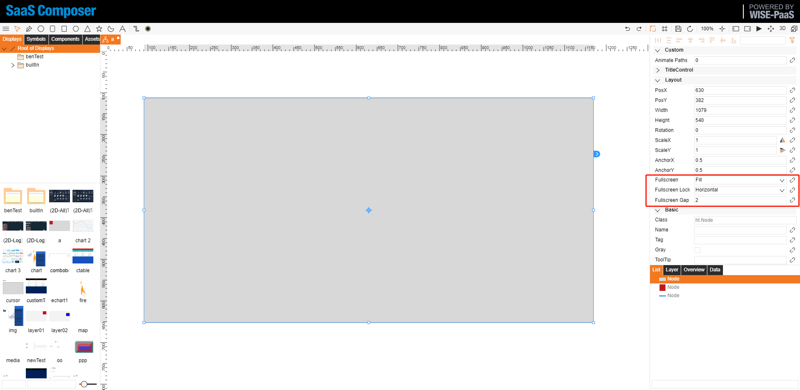
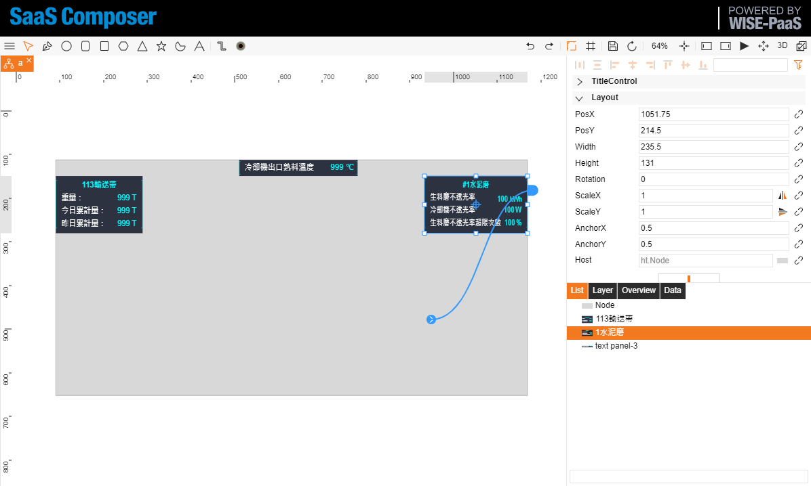

# Layout for 2D Drawings

Functionality of Layout:  

1. Create a rectangular node as the "Layout Root Node." This node is generally set to the screen dimensions, such as the common 1920*1080.   

Property                     | default          | Note
-----------------------------|------------------|-------------
fullscreen                   | None             | None / fill / uniform
fullscreen.lock              | None             | None / Horizontal(h) / vertical(v)
fullscreen.gap               | 2                | (root node maybe have border)

Fullscreen: The "Layout Root Node" needs to be set in the properties page (fill). If "Keep Ratio" or "Fit Content" is selected, the effect is similar.  
Fullscreen Lock: If "Horizontal" is not locked, the root node will always be the same size as the window. When locked horizontally, the width remains constant, and the height changes to maintain the aspect ratio between the node and the canvas. Finally, adjust the zoom to make the "Layout Root Node" fill the canvas.  
Fullscreen Gap: The default is 2. If the layout root node has a background color, there may be white margins on all sides. Setting it to 0 might cause scrollbars to appear, which can be disabled using `gv.setScrollBarVisible(false);`. 

## fullscreen: fill

## fullscreen: uniform

2. Set up connections for "snap-to" alignment.  

3. All elements that need layout are snapped to it.    

4. Select the nodes that need layout, and in the properties page under "Layout," choose the horizontal and vertical layout modes. Typically, selecting "Scale" is sufficient. If needed, other values can be chosen. For example, for the title bar, select (Horizontal: Center) and (Vertical: Top). The following values are explained:

- Horizontal  
    - Left: Maintain distance from the left side of the snap-to node.  
    - Center: Maintain distance from the center of the snap-to node.  
    - Right: Maintain distance from the right side of the snap-to node.  
    - Left & Right: Maintain distance from both sides of the snap-to node, will be stretched.  
    - Scale: Scale according to the snap-to node's scale.  
- Vertical  
    - Top: Maintain distance from the top side of the snap-to node.  
    - Center: Maintain distance from the center of the snap-to node.  
    - Bottom: Maintain distance from the bottom side of the snap-to node.  
    - Top & Bottom: Maintain distance from both top and bottom sides of the snap-to node, will be stretched.  
    - Scale: Scale according to the snap-to node's scale.  

