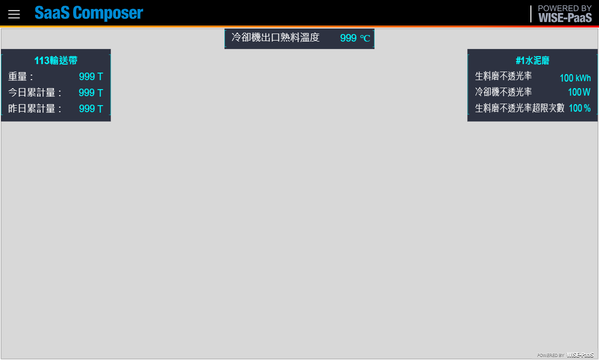
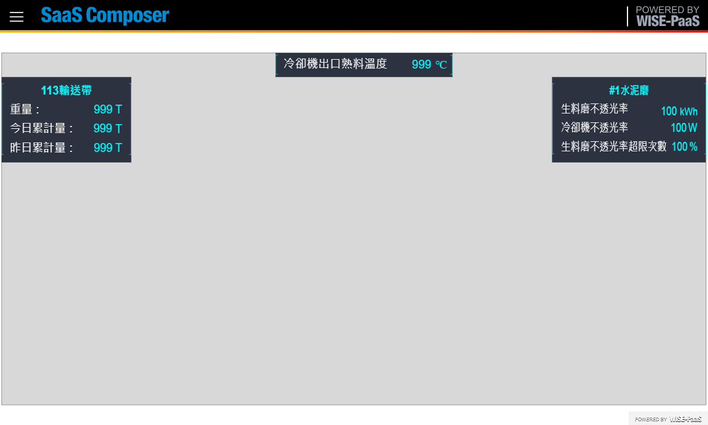
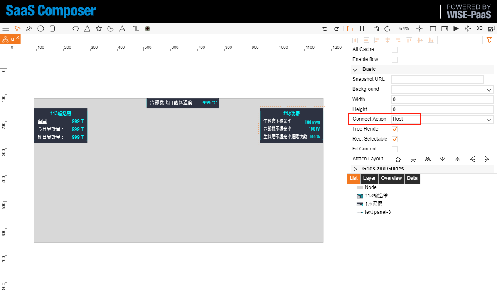
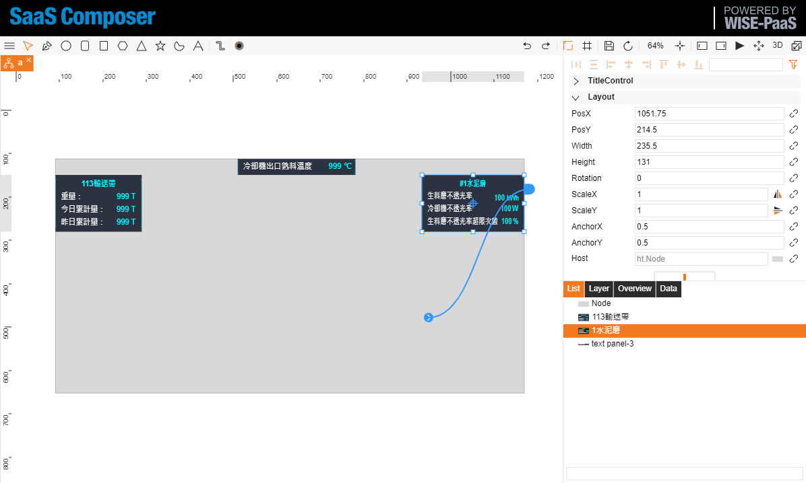
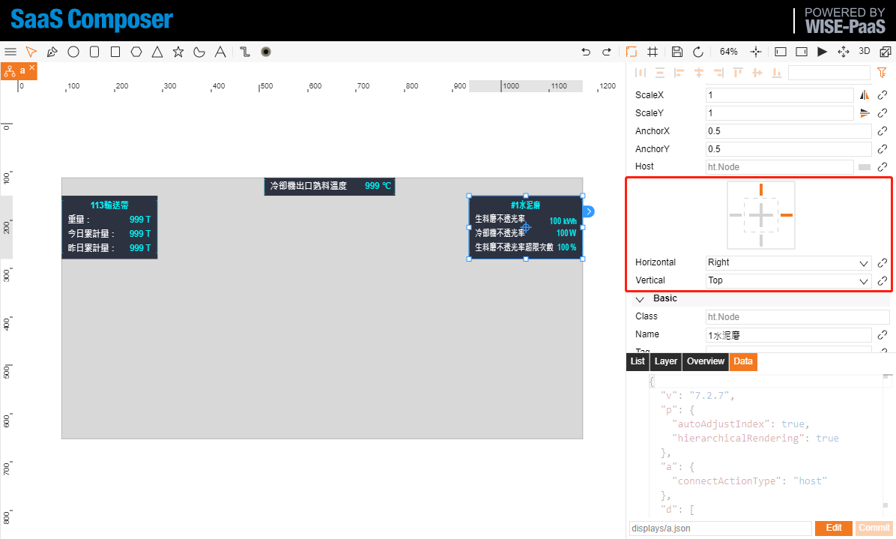
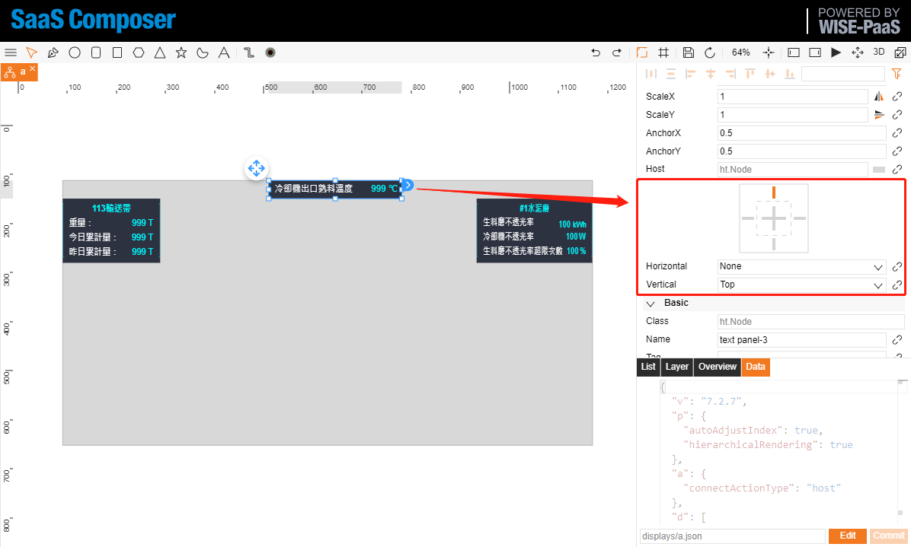

# 對2D圖紙做排版  

圖紙排版功能：  
1. 創建一個矩形節點作為“布局根節點”，這個節點一般大小設置為投放屏幕的大小，比如常用的 1920*1080。  

Property                     | default          | Note
-----------------------------|------------------|-------------
fullscreen                   | None             | None / fill / uniform
fullscreen.lock              | None             | None / Horizontal(h) / vertical(v)
fullscreen.gap               | 2                | (root node maybe have border)

全屏: 布局根節點需要在屬性頁中設置（填充）這里如果選了(等比)跟 fitContent 效果類似。  
全屏鎖定: (橫向）不選鎖定根節點會永遠跟窗口一樣大小，橫向鎖定後寬度會保持不變，改變高度來節點寬高比與畫布寬高比一致，最後修改 zoom 使“布局根節點”填充滿畫布。  
全屏間距: 默認是 2，布局根節點有背景色情況下會四周會出現白邊。設置0可能會出現滾動條，可以用 `gv.setScrollBarVisible(false);` 關閉。  

## fullscreen: fill

  

## fullscreen: uniform

  

2. 設定連接"吸附"  

  

3. 所有需要布局的元素都吸附於它。  

  

4. 選中需要布局的節點，在屬性頁【布局】中選擇橫向、縱向布局方式，一般都選【縮放】即可，有特殊可以選擇其他值，比如標題欄設置（橫向：中心）（縱向：上），以下是相關值說明

- 橫向
  - 左：相對於吸附節點左側距離保持不變
  - 中心：相對於吸附節點中心距離保持不變
  - 右：相對於吸附節點右側距離保持不變
  - 左&右：相對於吸附節點左右距離保持不變，會被拉伸
  - 縮放：跟隨吸附節點的縮放比例進行縮放
- 縱向
  - 上：相對於吸附節點上側距離保持不變
  - 中心：相對於吸附節點中心距離保持不變
  - 下：相對於吸附節點下側距離保持不變
  - 上&下：相對於吸附節點上下距離保持不變，會被拉伸
  - 縮放：跟隨吸附節點的縮放比例進行縮放

  

  