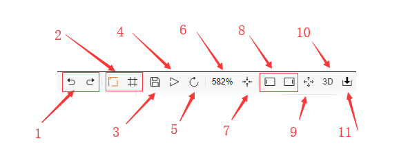
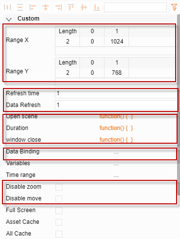

# Display related attributes

## I.	Interface related operations

1.	Undo, redo
2.	Show scale and network; orange means on, gray means off
3.	Save
4.	Preview
5.	Reload
6.	Zoom in/out percentage
7.	Zoom to full screen
8.	Show/hide left and right sidebars
9.	Full screen
10.	Switch to the 3D editor page
11.	Import file button

## II.	Attribute field

**1.	Expanded section**

1.	X-axis range, Y-axis range:
Adjust the initial display content range of the Sketchboard Viewer.
2.	Update frequency
In the Viewer page, the change frequency of the display and the binding data.
3.	Scene on open
The function code will only execute once at the beginning when the Viewer page is opened.
4.	During execution
The function code will be executed each time the Viewer page is refreshed.
5.	Browser close
The function code will execute when the Viewer page is closed.
6.	Data binding
User can customize the data binding list. After the list is completed, user can use the data name from the self-created list and apply to the component to display the data directly.
7.	Disable zoom, Disable drag
Settings for whether the display can be dragged or  zoomed in the Viewer page.
*.Simplified attributes button
Orange indicates some attributes are hidden; gray indicates all attributes are shown.

**2. 	Basics**

1.	Snapshot location:
Represents the location of the thumbnail of the display; if not filled in, a thumbnail will be automatically generated
2.	Background
Background color of the display
3.	Total number of elements
The total number of elements on the display
4.	Connected actions
Copy style, snap, parent and child, snap parent and child, create connection, copy size, and animation path
5.	Clock rotation
If enabled for a rotating element, a clock border will be displayed
