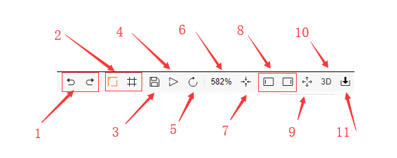
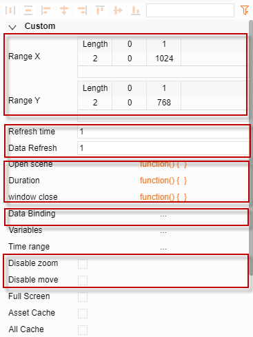
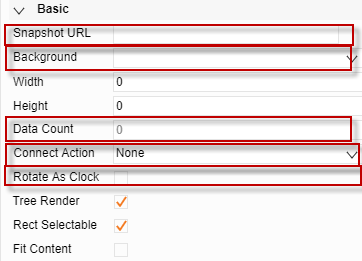

# 基本屬性介紹  

## 介面相關操作

1. 撤銷、重做                  
2. 提示刻度、網路，橘色開啟，灰色關閉
3. 保存                             
4. 預覽
5. 重新載入 
6. 縮放比例
7. 縮放到全屏
8. 顯示、隱藏 左右側邊欄
9. 全屏
10. 切換到3D製作頁面
11. 導入檔按鈕

## 屬性欄

1.擴展部分

1. X軸範圍，Y軸範圍

	調整 Sketchboard Viewer 初始顯示內容範圍

2. 更新頻率

	在Viewer 頁面中，圖紙以及其中綁定資料的變化頻率

3. 開啟場景

	此處函數會在 Viewer 頁面打開時運行一遍

4. 執行期間

	此處函數會在 Viewer 頁面每次刷新時執行一遍

5. 流覽器關閉

	此處函數會在 Viewer 頁面關閉時執行

6. 資料綁定

	使用者自訂綁定資料，綁定成功後，      在別處做資料綁定時可使用此處設定名稱來直接綁定資料

7. 取消縮放、取消移動

	設置在 Viewer 頁面中，圖紙是否可以拖動和縮放*. 簡化屬性按鈕      橘色隱藏部分屬性、灰色顯示全部屬性

2.基礎部分

1. 快照地址：

       表示圖紙的縮略圖，若不填會自動生成一個縮略圖

2. 背景

       圖紙背景顏色

3. 圖元總數 

     本張圖紙上所有的元素總數

4. 連接動作      

	拷貝風格、吸附、父子、吸附父子、創建連線、拷貝大小、動畫路徑

5. 時鐘式旋轉

      若開啟在旋轉元素是會顯示一個時鐘的邊框
