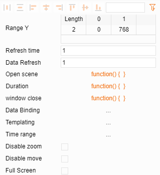
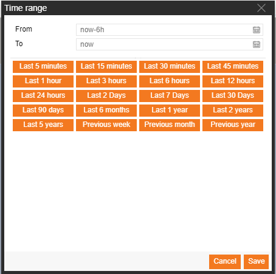
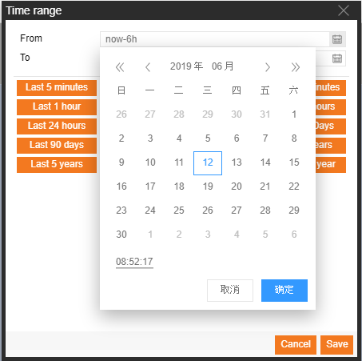

# Time selection
Open Time Selection in the attributes of the drawing sheet.

Set the time display as the default setting when the drawing sheet is opened 

Select a specific time interval using the popup calendar

