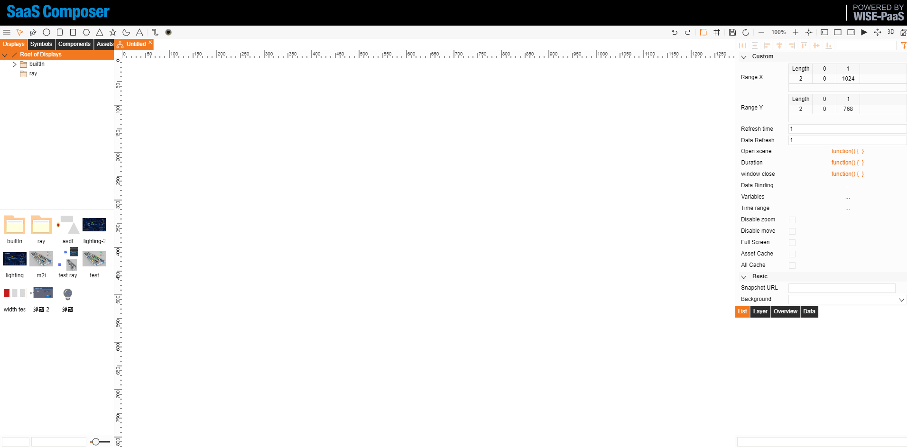

# User-Defined Data Binding
**Usage method:**

User can create an item list of binded data and may apply for the future use on the display.

When sketching on the display, if data binding is necessary, select the userDefined type and then choose a custom name for data binding.

Purpose:
To avoid the tedious operation of frequent selection when multiple data bindings are needed and reduces the possibility of errors in selection.

1.	Open the display and click the data binding button on the right to open the data binding window.
2.	Click the Add button in the upper left corner to add a new data binding table.
3.	Click the newly added table to open the specific binding action page.
4.	Set a custom name in the attribute field, then perform normal data binding, and finally click the save button.
5.	Select userDefined on the specific bound element, then click name to bring up the drop-down list, select the desired custom data binding name, and click confirm.