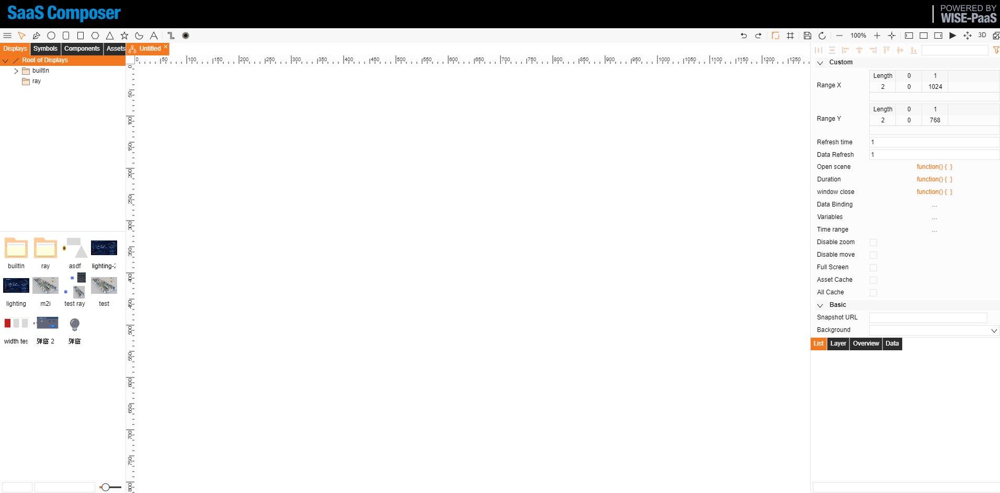

# 用戶自定義資料綁定  

使用方式：     
用戶可以在本張圖紙上一次性綁定好將要用到的資料，並自訂名稱。
在繪製圖紙時，若需要綁定資料可以選擇 userDefined 類型，然後選擇自訂的名稱來進行資料綁定。
作用：     
可避免在需要多次綁定資料時，進行頻繁選擇所帶來的繁瑣操作以及減少頻繁選擇中出現失誤的可能性。

1. 打開圖紙，點擊右側 資料綁定 按鈕，打開資料綁定視窗
2. 點擊左上角 ADD 按鈕，增加一個新的資料繫結欄位表
3. 點擊新增的列表，打開具體綁定的動作頁面
4. 屬性欄中設置自訂名稱，然後進行正常的資料綁定，最後點擊保存按鈕
5. 在具體綁定的元素上選擇 userDefined，然後點擊 name 調出下拉清單，    選擇想要的自訂資料綁定名稱，點擊確定即可
