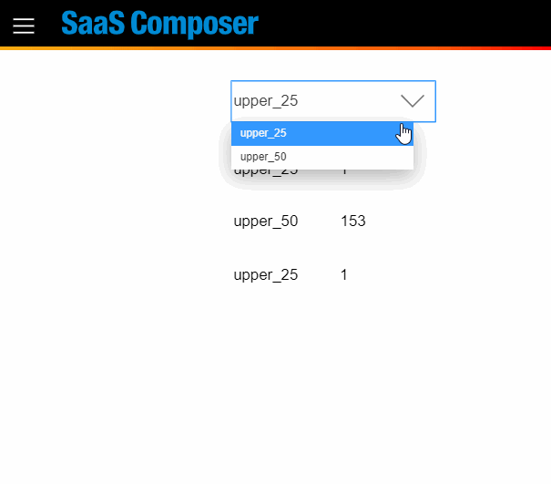

# Variable Change Setting  

## Open the Variable window in the attribute of the drawing sheet

Enter the variable name and values; different values are separated using a comma (,) 

ex:
Name var1  
Value A,B,C,D  

## Apply the variable to the attribute

Use `[[var1]]` or `$var1` to represent a string that is used to replace a variable

On the preview page, variables will be replaced by the corresponding string according to the setting. 

## Add the variable selection icon

Select the icon  
Symbols > builtIn > sc_control > variableChange  

Enter the variable name in the “attribute name” field

Preview 

## Use the “variable” function in the data source (Grafna simple json)

In the Data Binding window, enter `[[var name]]` in the “target” field.

Preview 

## API Script

In Viewer, get all variable objects table:  

	dataRefreshUtil.variableSrv.getCurVarMapTable()

Set Variable value： 

	dataRefreshUtil.variableSrv.setVariable(name, value, callback)

Batch Set Variable value： 

	dataRefreshUtil.variableSrv.setVariables(varArray, callback)
	// varArray = [{name, value}]

Get Variable value： 

	dataRefreshUtil.variableSrv.getVariable(name)

