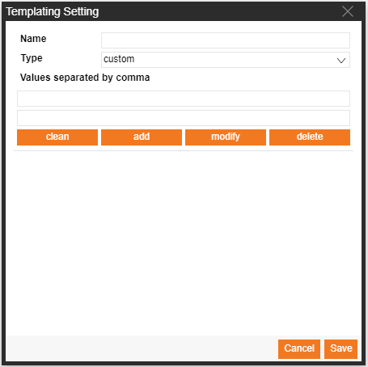
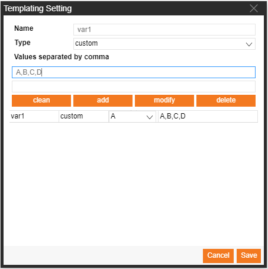
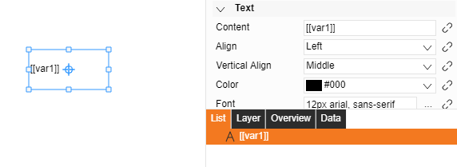
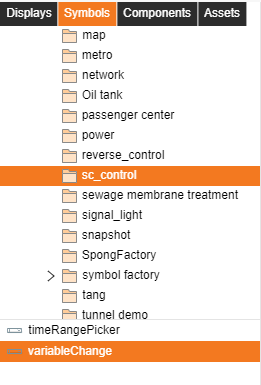
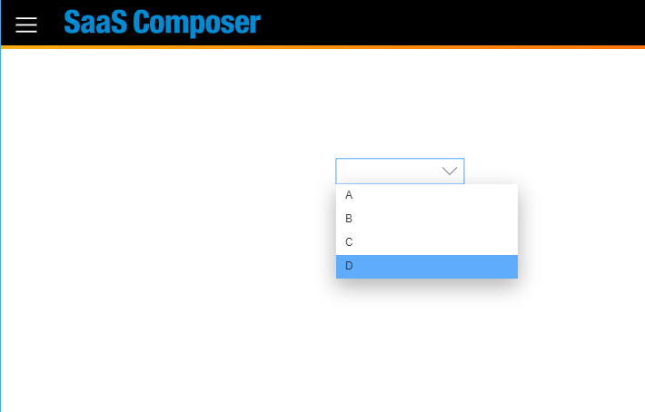
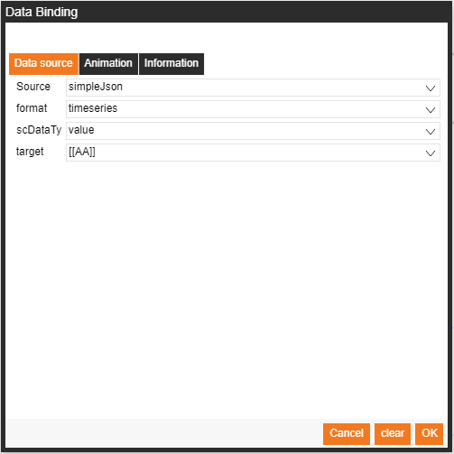
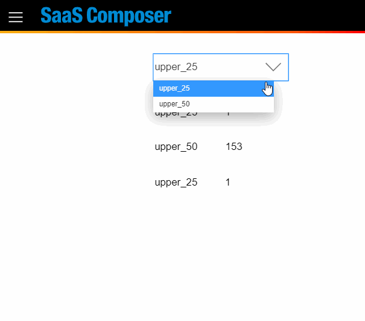

# 變數設定  

## 從圖紙屬性開啟變量視窗

  

輸入變量名稱及變量值列表並以 (,) 分隔變量值

    ex.  
    Name var1  
    Value A,B,C,D  

  

## 在屬性中使用變量

使用 `[[var1]]` 或 `$var1` 代表要取代為變量的字串

  

在預覽頁面時，變量將會依照設定被取代為對應的字串  

  
## 添加變量選擇圖標 

選擇圖標  
Symbols > builtIn > sc_control > variableChange  

在"屬性名"的位置填入變量名稱

  

預覽運行

  

  

## 在數據源使用變量功能 (Grafna simple json)

在資料綁定視窗中的"目標"(target)裡填入 `[[var name]]`   

  

預覽運行 

  

## 相關腳本

在Viewer取得所有變量物件:  

	dataRefreshUtil.variableSrv.getCurVarMapTable()

設定變量值： 

	dataRefreshUtil.variableSrv.setVariable(name, value, callback)

批量設定變量值： 

	dataRefreshUtil.variableSrv.setVariables(varArray, callback)
	// varArray = [{name, value}]

取得特定變量： 

	dataRefreshUtil.variableSrv.getVariable(name)