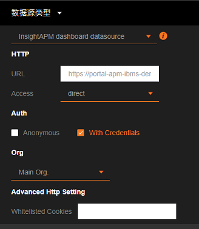

# APM  

**To connect the WISE-PaaS/SaaS Composer to the APM, you need to set the URL pairing in SaaS Composer Management first.**  
 
## APM 2 (InsightAPM datasource)   
**Connect to the portal-APM App:**  

  

1. Click on "**Data Source**" to enter the configuration options. Click the "**Add Data**" Source button to open the configuration window for adding the data source.
2. In the data source settings, the data source name option on the right is for naming the data source.  
3. The "data source"  option in the middle is for choosing the type of the data source to add; select “**InsightAPM datasource**” here. 
4. Fill in the External Domain URL of the "apm-portal-apm" to the APM data source URL inputbox. 

5. In the URL option in the HTTP entry, and add "`https://`" to the front. 
6. Add"/api-apm" at the end of the url address.
example: "https://" **+** "portal-apm-twcc-aiot.tmptwcc.wise-paas.com" **+** "/api-apm"
7. Access options are set via proxy or direct access; select direct for “**APM SimpleJson**”.    Check the With Credentials option in the Auth item.
8. . Click "**Save**".

## APM 3 (InsightAPM dashboard datasource)  

  

1. Select source type **InsightAPM dashboard datasource**  
2. Fill in the External Domain URL to the APM data source URL inputbox.(Not add `/api-apm` in url path)  
3. Set Anonymous or Credentials mode.  
4. Select APM Org.
