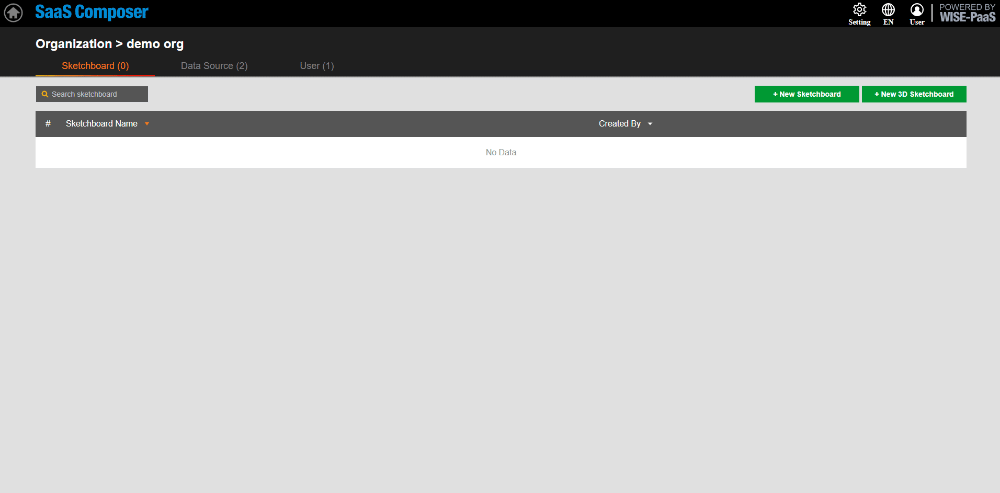
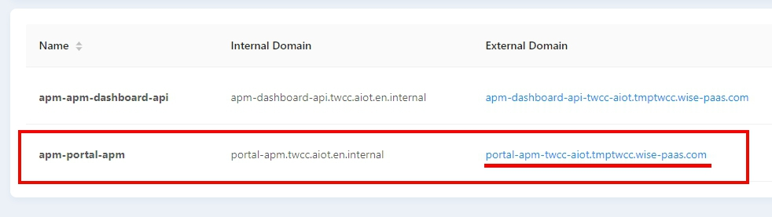

# APM  
**SaaS Composer 要連接APM的資料需要先在SaaS Composer Management裡面設定好URL的配對**

## APM 2 (InsightAPM datasource)

連接portal-APM APP:

1. 點擊 "資料來源" 進入配置選項, 按一下 添加資料來源 按鈕打開添加資料來源的配置視窗
2. 在資料來源的設置中, 右側資料來源名稱選項為資料來源命名
3. 中間資料來源類型選項選擇添加資料來源的類型,這裡選擇  "**InsightAPM datasource**"
4. HTTP項中的URL選項處填寫要連接的 APM 資料來源的"apm-portal-apm"的 URL，複製External Domain的URL

5. 並在前端加上“https://”
6. 尾端加上"/api-apm"
 example: "https://" **+** "portal-apm-twcc-aiot.tmptwcc.wise-paas.com" **+** "/api-apm"
7. Access選項設置通過代理或者直接訪問, APM SimpleJson這裡選擇direct
8. Auth項中將"With Credentials"選項勾選
9. 點擊保存 

## APM 3 (InsightAPM dashboard datasource)  

1. 選擇數據源 **InsightAPM dashboard datasource**  
2. 輸入 URL，不須額外添加 /api-apm  
3. 設定驗證模式  
4. 選擇組織org.  
