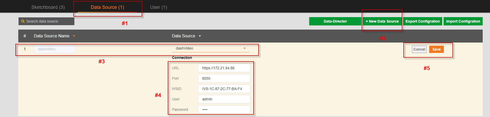
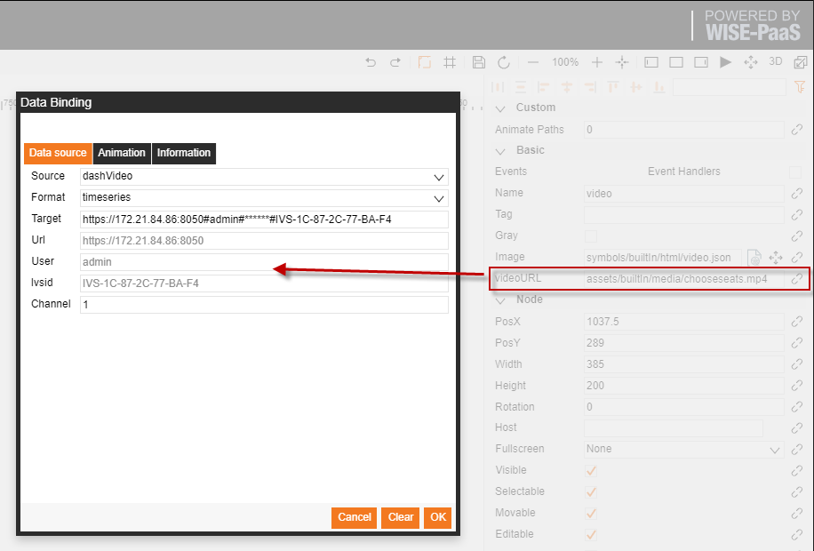
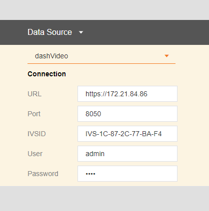

# DashVideo  

**To connect the SaaS Composer to the DashVideo data, you need to deploy the Dashvideo server first.**

**Connect to DashVideo App:**

  

1. Click on "**Data**" Source to enter the configuration options. 
2. Click the "**Add Data**" Source button to open the configuration window for adding the data source. 
3. Set the custom data source name and choose the type of the data source to add; select "**DashVideo**" here. 
4. Fill in the relevant configuration information of the Dashvideo server. 
5. Click "**Save**".

**Using Dashvideo data source:**  

The use of the DashVideo data source needs to be used in conjunction with the Dashvideo icon in the HTML folder in builtIn.  

  

**DashVideo icon function:**
   
Embed Dashvideo video with the Dashvideo symbol Usage instructions:   
1. Configure the data source of Dashvideo in the management configuration page, as shown in the figure on the right.
2. Drag the Dashvideo symbol from the html folder in builtIn into the display.
3. Click the data binding link to the right of the Dashinfo attribute to open the binding interface.
4. Select a Dashvideo data source that is already configured.
5. Fill in the channel number and click "**Save**".
6. URL, USER, PASSWORD, IVSID information will be filled in automatically and cannot be changed.  

  
