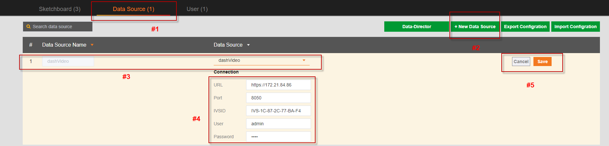
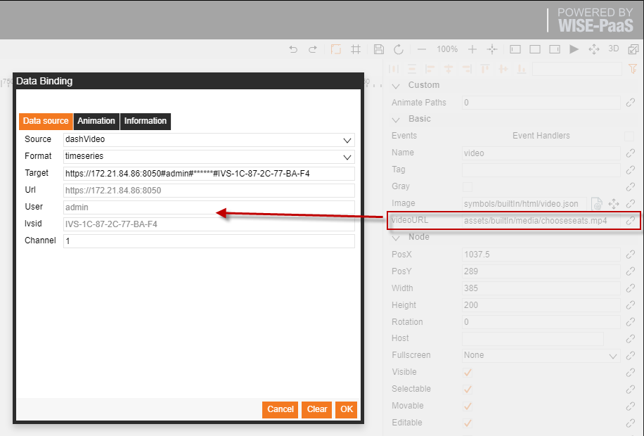
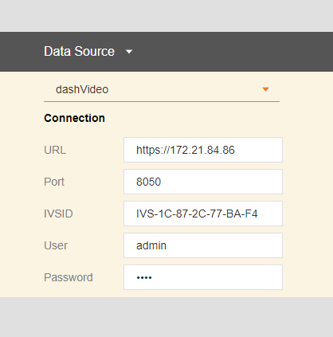

# DashVideo  

**SaaS Composer 要連接dashVideo的資料需要先部署dashvideo伺服器**

**連接dashVideo APP:**

  

1. 點擊 資料來源 進入配置選項
2. 按一下 添加資料來源 按鈕打開添加資料來源的配置視窗
3. 自訂資料來源名稱，並選擇添加資料來源的類型,這裡選擇  dashVideo
4. 填寫dashvideo伺服器的相關配置資訊
5. 點擊保存即可

dashvideo資料來源的使用：

dashvideo 資料來源的使用需要結合圖示 builtIn 中 html 資料夾內的 dashavideo 圖示來使用

  

   使用 dashvideo圖示來內嵌入一個dashvideo視頻使用方法說明：
   1. 在management配置頁面配置dashvideo的資料來源，方式如下圖
   2. 將 builtIn 中 html 資料夾下的 dashvideo 圖示拖入圖紙
   3. 點擊 dashinfo 屬性右側的資料綁定連結打開綁定介面
   4. 選擇配置好的 dashvideo 資料來源
   5. 填寫 channel 號，點擊保存即可
   6. URL、USER、PASSWORD、IVSID資訊將自動填好且不可改變
   
  
