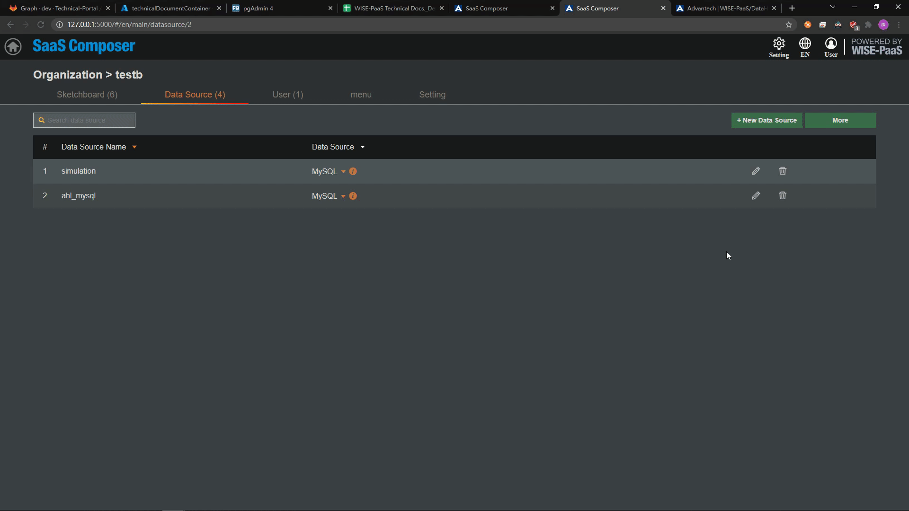

# 绑定 DataHub 數據源 
要連接DataHub的資料需要先在Management裡面設定好URL的配對

**連接portal-DataHub APP:**

1. SaaS Composer Management進入需要設定的Org後選擇資料來源Tab頁
    點擊 添加資料來源 按鈕打開添加資料來源的配置視窗
2. 設置自訂資料來源名稱，並選擇添加資料來源的類型,這裡選擇  Datahub datasource
    (***注意：如DataHub為2.0.12以上版本，請選擇 Datahub v1**)
3. HTTP項中的URL選項處填寫要連接的DataHub資料來源 portal 的URL，並在前端加上“https://”，尾端加上“api/v1/SimpleJsons”
   
4. Access選項設置通過代理或者直接訪問, DataHub SimpleJson這裡選擇direct

     Auth 選項中	將With Credentialsx選項勾選，或者輸入EnSaaS帳號密碼
5. 點擊保存