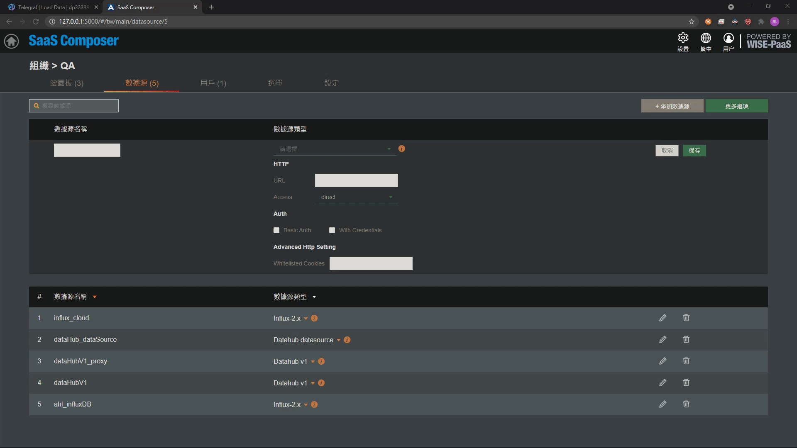
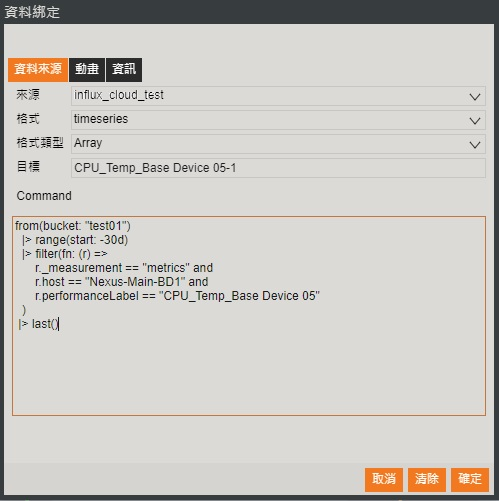

# InfluxDB  

**SaaS Composer to connect with InfluxDB that find the setting documents and fulfill in correct information**

**Connect with InfluxDB**

1. Select InfluxDB and search your output config file
2. Configure your file name and add the source type. Choose Influx-2.x
3. Fill in URL, Organization, Bucket respectively
4. Enter [Account Name:Password] in Token, or use the Token provided by InfluxDB
5. Click “Save” to save the setting

**Bind InfluxDB:**

1. Select the created data from file
2. Choose Format: timeseries, Type of Format: Array
3. Target: Fill in name of lable
4. Command: Choose segment between onset time and ended time
