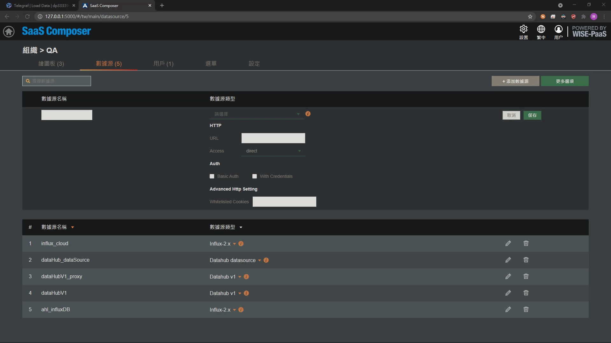

# InfluxDB  

**SaaS Composer 要連接InfluxDB的資料需要找出設定檔，填入正確的配置**

**連接InfluxDB:**

1. 打開 InfluxDB 搜尋您的 output config 檔案
2. 設置自訂資料來源名稱，並選擇添加資料來源的類型,這裡選擇 Influx-2.x
3. 依序填入 URL、Organization、bucket
4. Token選項中 可填入 [帳戶名稱:密碼]，或者可以使用InfluxDB所提的Token
5. 點擊保存即可 

**綁定InfluxDB:**

1. 資料來源選擇剛創建好的數據源
2. 格式選擇 timeseries、格式類型為 Array
3. 目標 填入標籤名稱
4. 語法部分 可以選擇起始時間以及結束時間區段
