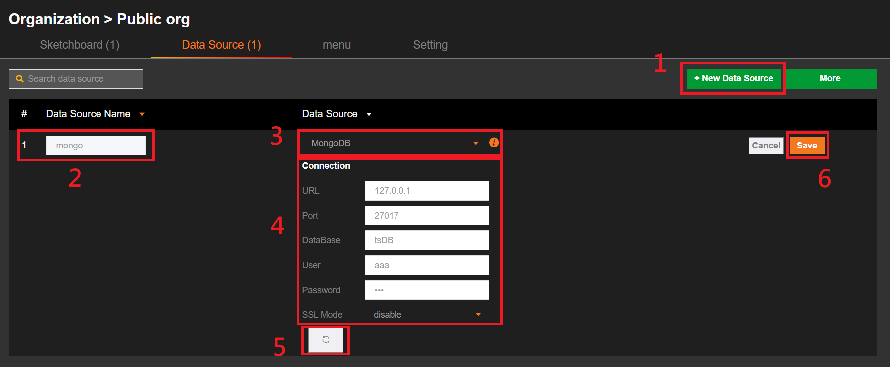
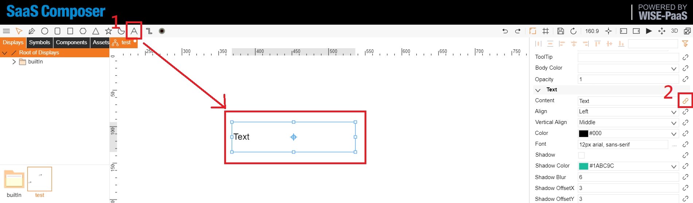
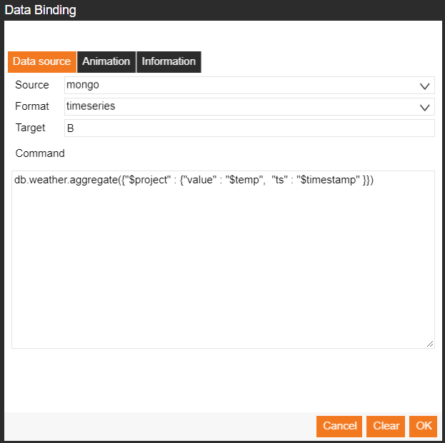
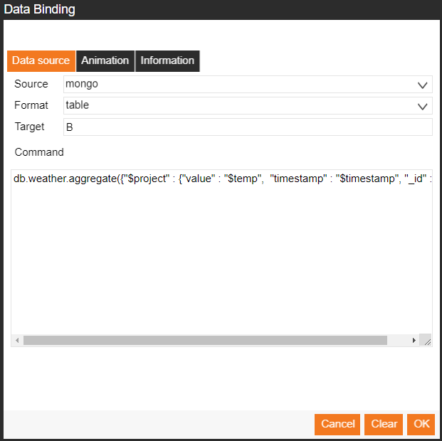
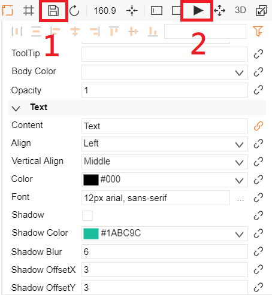
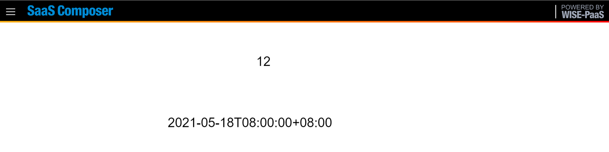

# Using MongoDB as a Data Source in SaaS Composer  

This guide provides step-by-step instructions on how to add and configure MongoDB as a data source in SaaS Composer.  

## Table of Contents  
1. [Add Datasource](#add-datasource)  
2. [Data Binding](#data-binding)  
    - [Data Binding Format (Timeseries)](#data-binding-format-timeseries)  
    - [Data Binding Format (Table)](#data-binding-format-table)  
3. [Preview Bound Data](#preview-bound-data)  

## Add Datasource  

### Go to the Data Source List Page  
Navigate to the data source list page of your organization.  

  

### Steps to Add a New Data Source  

1. **Add a new data source**: Click the button to add a new data source.  
2. **Give the data source a name**: Enter a unique name for your MongoDB data source.  
3. **Select “MongoDB” as the data source type**: From the dropdown menu, choose “MongoDB”.  
4. **Set the connection information**: Enter the necessary connection details (e.g., URI, username, password).  
5. **Verify the connection**: If the connection is successful, a “Data Source Connection Successful” message will appear at the top of the page.  
6. **Save the data source**: Click the “Save” button.  

## Data Binding

### Bind Text to Data

1. **Add a text element**: Insert a text element where the data will be displayed.
2. **Open the data binding window**: On the right side of the page, go to `text → content` and click the paperclip icon to open the data binding window.




### Data Binding Format (Timeseries)

1. **Unified Binding Format**:
    - **Source selection**: Choose the data source name added in the data source list. The type must be “MongoDB”.
    - **Format**: Select “timeseries”.
2. **Display Method**:
    - Only supports **aggregate** queries, e.g., `db.collection_name.aggregate`.
    - The fields required in “timeseries” are `value` and `ts`. If these fields do not exist in your data, use **$project** to rename them.

Example query:
```javascript
db.datatest.aggregate({ "$project": { "value": "$A", "ts": "$B" }})  
```

  

### Data Binding Format (Table)    

1. **Unified Binding Format**:  
    - Source selection: Choose the data source name added in the data source list. The type must be “MongoDB”.  
    - Format: Select “table”.  
2. **Display Method**:  
    - Only supports aggregate queries, e.g., db.collection_name.aggregate.  
    - No field name restrictions.  


Example query:
```javascript
db.datatest.aggregate({ "$project": { "value": "$A", "time": "$B", "zg": "$_id", "_id": 0 }})
```
Set "_id": 0 if you don't want to include the _id field from the collection




## Preview Bound Data  

### Preview the Text Message of the Bound Data Source  
  - **Save the text message settings**: Click the save button at the top right to save the settings.
  - **Preview the data**: Click the triangle icon at the top right to preview the data. The preview page is shown below.



### Result  



By following these steps, you can successfully add and configure a MongoDB data source in SaaS Composer, bind data to text elements, and preview the results.
