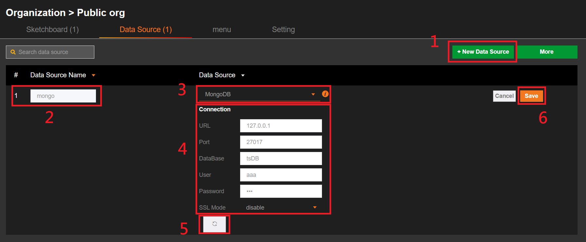
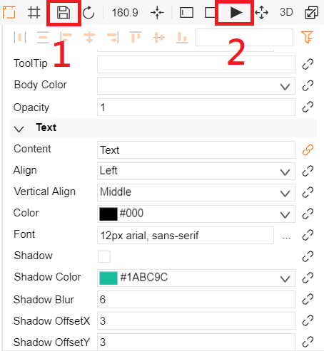

# MongoDB  

## 1. 添加數據源
**到組織中的數據源**



步驟 :
1. 添加數據源
2. 填寫數據源名字
3. 選擇數據源類型為"MongoDB"
4. 設置連線資訊
5. 點擊"保存"存檔
6. 如果連線成功，彈出"數據源連接成功"

## 2.1 資料綁定
步驟 :

1. 新增文本，可以更改文本顯示的文字內容
2. 在右方的欄位中，找到文本 → 內容 → 按下連結按鍵，彈出資料綁定的視窗


## 2.2.1 資料綁定格式 (Timeseries)

1. 資料綁定設定 :
* 來源 : 必須要是連接“MongoDB”的數據庫名字
* 格式 : 選擇 “timeseries”
2. 顯示資料方法 : 
* 只支援 **aggregate** , ex : db.collection_name.aggregate
* 欄位名字必須包含 “value, ts”，如果資料表欄位沒有包含這兩項, 可以使用 **$project**


example:  
```
db.datatest.aggregate({"$project": { "value": "$A", "ts":"$B" }})
```

## 2.2.2 資料綁定格式 (Table)
1.  資料綁定設定 :
* 來源 : 必須要是連接“MongoDB”的數據庫名字
* 格式 : 選擇 “table”
2. 顯示資料方法 : 
* 只支援 **aggregate** , ex : db.collection_name.aggregate
* 無欄位限制


example:  
```
db.datatest.aggregate({"$project": { "value": "$A", "time":"$B", "zg":"$_id","_id":0 }})
```
設定 `"_id":0`, 從 collection 回應中移除 `_id` 屬性.   

## 2.3 預覽文本顯示的資料
步驟 :

1. 點擊右上方功能欄位的儲存按鈕  
2. 點擊執行按鈕，預覽文本顯示的資料  

  

3. 結果  
