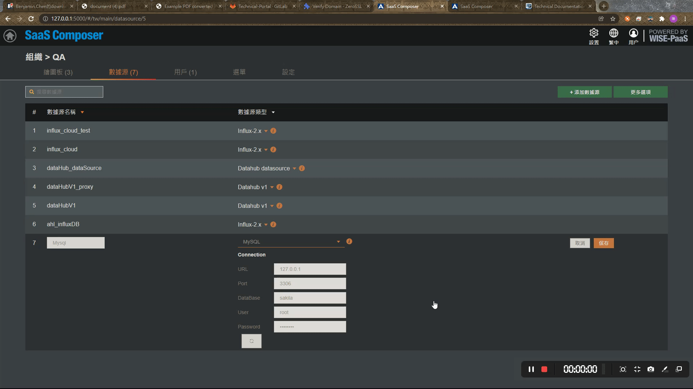
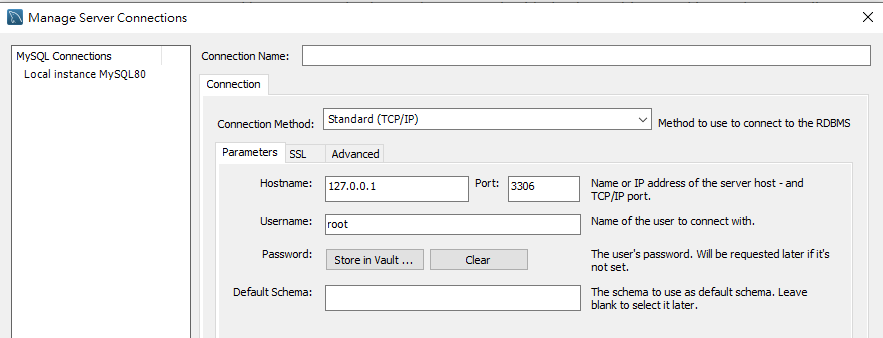
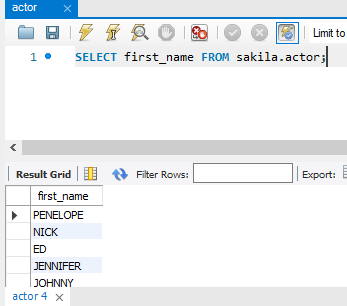
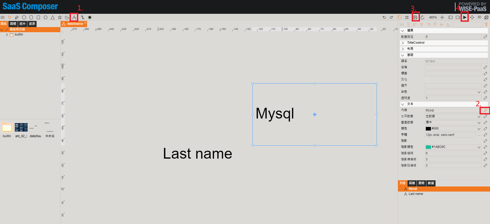
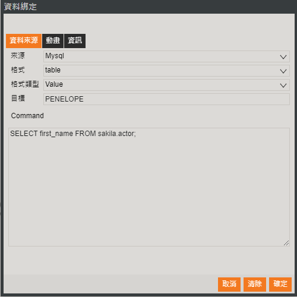
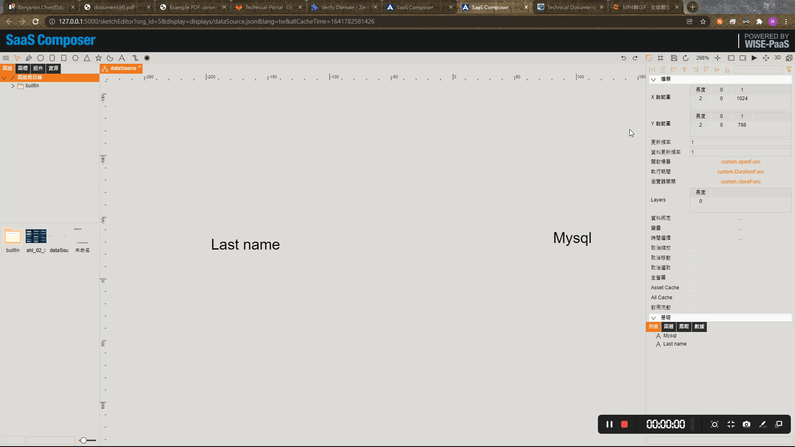

# MySQL  

## 1. Add Data Source
**Navigate to the data source list page of a specific organization.**
Steps：
1. Add a new data source.
2. Provide a name for the data source.
3. Select the data source type as "MySQL."
4. Configure the connection information.
5. Click "Save" to store the data source.
6. If the connection is successful, a "Data Source Connected Successfully" message will appear at the top of the page.

## 2. Bind Data Source

First, view the database.  

Steps：  
1. Add text; the displayed text can be changed as desired. Click on the added text message.  

2. On the right side of the page, go to Text → Content → Click on the pin icon to open the data binding window.  

3. Enter SQL command. (The SQL command entered here is for querying purposes only. Any commands that involve adding, deleting, modifying data in the database will be prohibited.)  

4. Click the save button at the upper-right corner to save the settings for the text message.   

5. Click the triangle icon at the upper-right corner for a preview. (Preview page is shown below.)  

6. Result  

