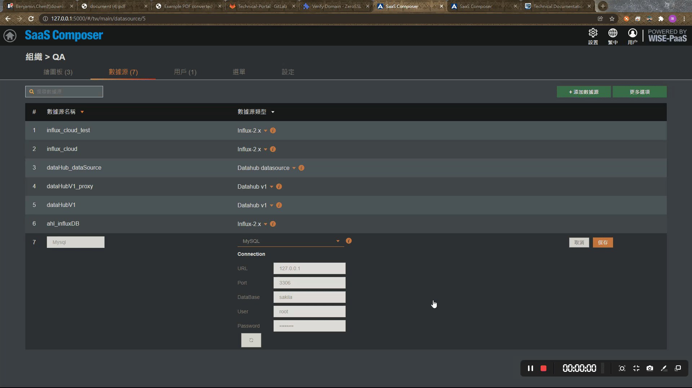
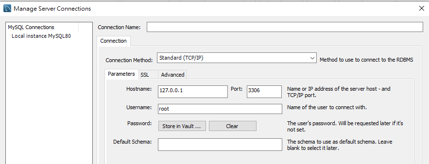
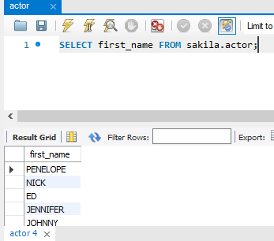

# MySQL  

## 1. 新增數據源
**到某組織的數據源列表頁面**
依序步驟：
1. 添加一個新的數據源。
2. 給定數據源名稱。
3. 數據源類型選擇「MySQL」。
4. 設定連線資訊。
5. 點擊「保存」，儲存該數據源。
6. 若連接成功，頁面上方會跳出「數據源連接成功」。

## 2.綁定數據源
 先檢視數據庫  

依序步驟：  
1. 新增文字，文字顯示的字可以隨意更改, 點擊新增之文字訊息。  
2. 於頁面右方，文本 → 內容 → 點擊迴紋針圖案，跳出資料綁定的視窗。  
  
3. 輸入SQL指令。 (此處輸入的sql指令僅供查詢使用，任何對資料庫做新增、刪除、修改等指令皆會被禁止)**。  
  

4. 點擊右上方儲存按鈕之圖案，儲存該筆文字訊息設定。
5. 點擊右上方三角形圖案做預覽。 (預覽頁面如下所示)
6. 結果  

