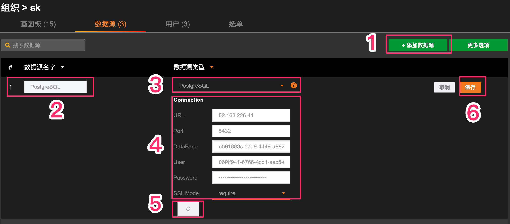
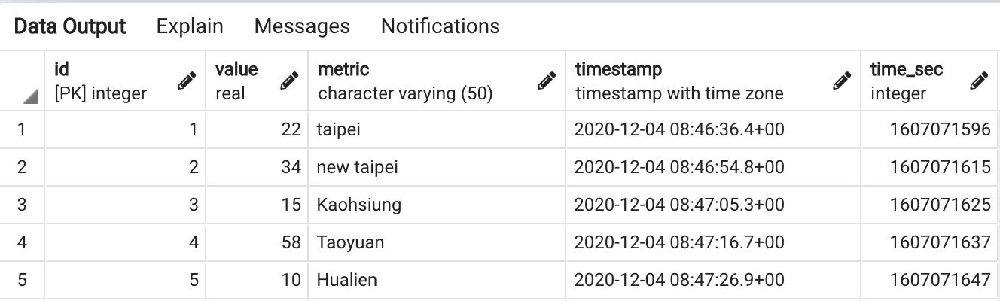

# PostgresQL

## 1. Add data source
**Go to the data source list page of an organization**

Sequential steps:
1. Add a new data source.
2. Give the data source name.
3. Select "PostgreSQL" as the data source type.
4. Set the connection information.
5. Click "Save" to save the data source.
6. If the connection is successful, "Data Source Connection Successful" will pop up at the top of the page.

## 2.1 Data format (Time_series)

Sequential steps:
1. Add text, the words displayed in the text can be changed at will, click on the new text message.
2. On the right side of the page, text → content → click the paperclip pattern to pop out the window of data binding.

## 2.2 Mode of operation
1. View the database first

2. Unified binding format:
- Source selection, the data source name added in the data source list, the type must be "PostgreSQL"
- The format is "timeseries", and the target must be the value in the table

3. Two methods to display data
- method1: The field names that must be included in "timeseries" are "value, time_sec, metric". If your own data table does not have these three fields, you can use aliases.
ex: SELECT **a AS value**, **b AS time_sec**, **c AS metric** FROM schema.table
- method2: Because the name of the database already contains the field name, all data can be queried
- **Enter the SQL command. (The sql command entered here is for query purposes only, and any commands such as adding, deleting, or modifying the database will be prohibited)**.

## 2.3 Preview the text message of the bound data source
Sequential steps:
1. Click the pattern of the save button at the top right to save the text message settings.
2. Click the triangle pattern on the upper right to preview. (The preview page is shown below)

3. Results

