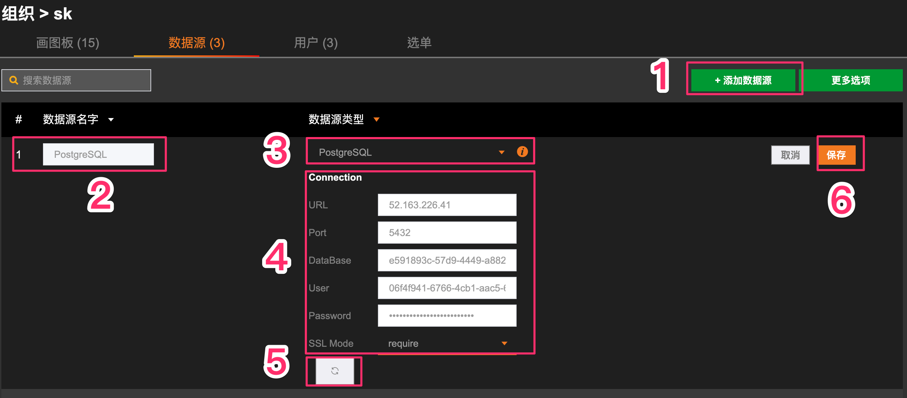
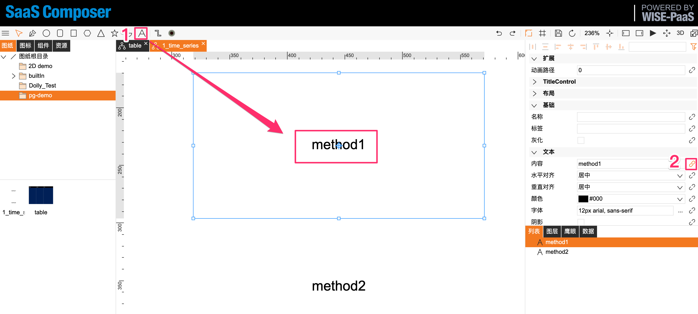
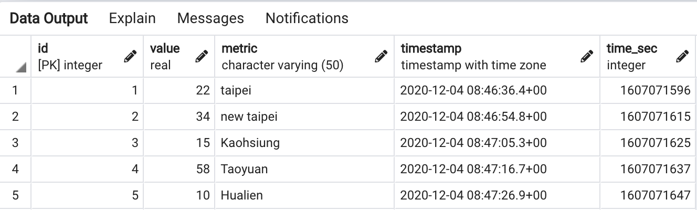
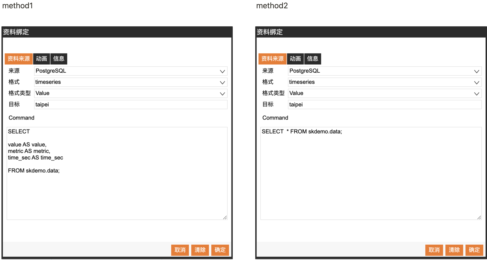
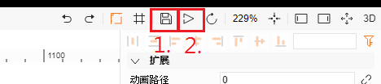
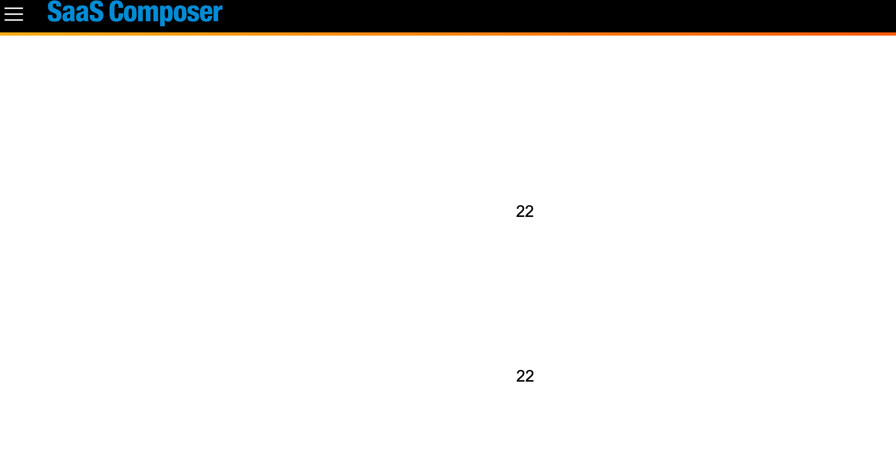

# PostgresQL

## 1. 新增數據源
**到某組織的數據源列表頁面**

依序步驟：
1. 添加一個新的數據源。
2. 給定數據源名稱。
3. 數據源類型選擇「PostgreSQL」。
4. 設定連線資訊。
5. 點擊「保存」，儲存該數據源。
6. 若連接成功，頁面上方會跳出「數據源連接成功」。

## 2.1 數據格式(Time_series)

依序步驟：
1. 新增文字，文字顯示的字可以隨意更改, 點擊新增之文字訊息。
2. 於頁面右方，文本 → 內容 → 點擊迴紋針圖案，跳出資料綁定的視窗。

## 2.2 操作方式
1. 先檢視數據庫

2. 統一綁定格式：
- 來源選擇，數據源列表新增之數據源名稱，類型必須是「PostgreSQL」
- 格式為「timeseries」，且目標必須是資料表有的value

3. 兩種方法顯示數據
- method1 : 「timeseries」必須包含的欄位名稱有「value、time_sec、metric」。若本身資料表沒有這三個欄位，則可使用別名的方式。
ex: SELECT **a AS value**, **b AS time_sec**, **c AS metric** FROM schema.table
- method2 : 因為數據庫的名稱已包含欄位名稱，所以可以查詢所有數據
- **輸入SQL指令。 (此處輸入的sql指令僅供查詢使用，任何對資料庫做新增、刪除、修改等指令皆會被禁止)**。

4. Note:  
**所有"目標"都必須是唯一的，相同則有可能數值會互相覆蓋**  
**timeserires格式，metric字串要與target相同** 

## 2.3 預覽綁定數據源的文字訊息
依序步驟：
1. 點擊右上方儲存按鈕之圖案，儲存該筆文字訊息設定。
2. 點擊右上方三角形圖案做預覽。 (預覽頁面如下所示)

3. 結果

