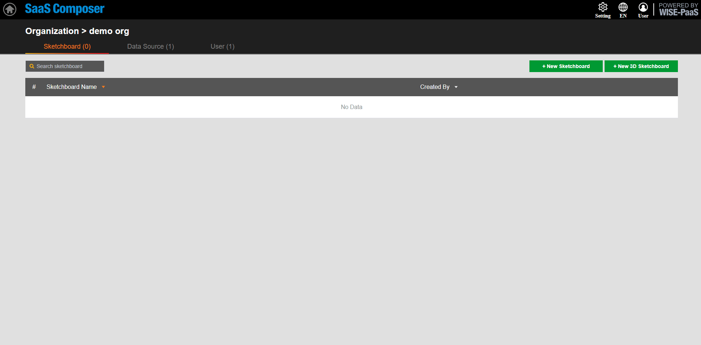

# RMM  

**To connect the SaaS Composer to RMM, you need to set the URL pairing in SaaS Composer Management first.**

**Connect to the portal-RMM App:**

1. To enter SaaS Composer Management, the Org needs to be set and select the data source Tab page afterwards.    
Click the "**Add Data Source**" button to open the configuration window for adding the data source. 
2. Set the custom data source name and choose the type of the data source to add. Select “**rmm-simple-json-datasource-sso**” here. 
3. In the URL option in the HTTP entry, fill in the URL of the portal of the RMM data source to be connected, and add "`https://`" to the front and "`/rmm/v1/grafana/simplejson`" to the end. 
4. Access options are set via proxy or direct access; select direct for “RMM SimpleJson”.    
Check the With Credentials option in the Auth item. 
5. Click "**Save**".