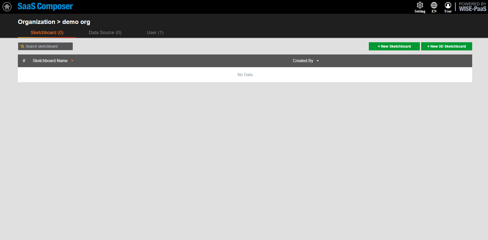

# SCADA  

**To connect WISE-PaaS/SCADA data in WISE-PaaS/SaaS Composer, you need to configure the URL pairing in the Management section first.**  

**Connecting to the portal-scada APP:**  

1. In SaaS Composer Management, after entering the required Org, select the Data Sources tab.Click the "Add Data Source" button to open the configuration window for adding a data source.  

2. Set a custom name for the data source and choose the type of data source to add. Here, select "scada-simple-json-datasource-sso."  

3. In the HTTP section, fill in the URL option with the URL of the SCADA data source portal you want to connect to. Add "https://" at the beginning and "/api/simplejsons" at the end of the URL.  

4. In the Access section, configure whether to access through a proxy or directly. For SCADA SimpleJson, choose "direct."  

In the Auth section, check the "With Credentials" option.  