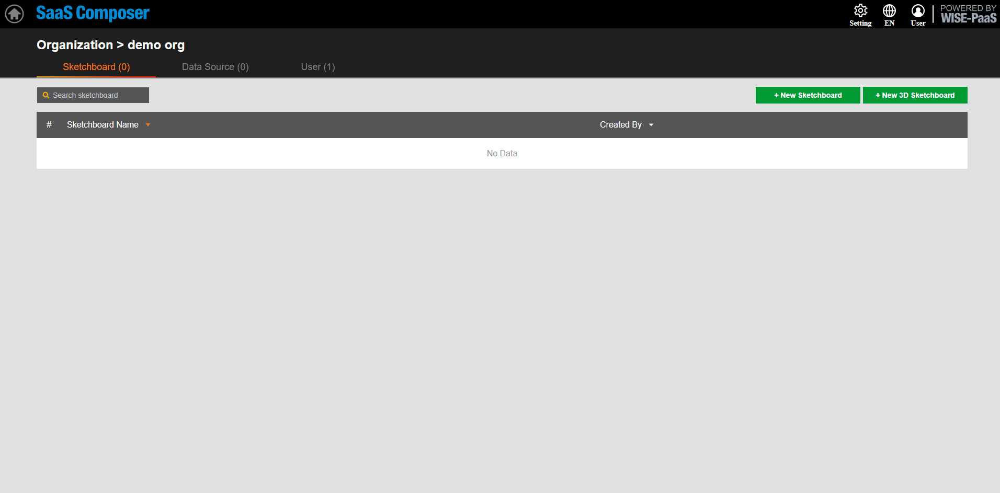

# SCADA  

**WISE-PaaS/SaaS Composer 要連接WISE-PaaS/SCADA的資料需要先在Management裡面設定好URL的配對**  

**連接portal-scada APP:**  

1. SaaS Composer Management進入需要設定的Org後選擇資料來源Tab頁
    點擊 添加資料來源 按鈕打開添加資料來源的配置視窗  
2. 設置自訂資料來源名稱，並選擇添加資料來源的類型,這裡選擇  scada-simple-json-datasource-sso  
3. HTTP項中的URL選項處填寫要連接的SCADA資料來源 portal 的URL，並在前端加上“https://”，尾端加上“/api/simplejsons”  
4. Access選項設置通過代理或者直接訪問, SCADA SimpleJson這裡選擇direct
    Auth項中將With Credentialsx選項勾選  