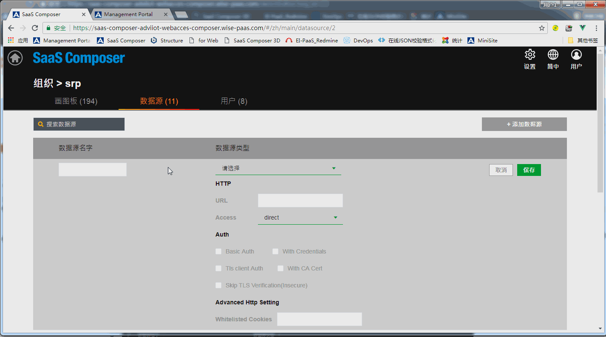

# SimpleJson  

**To connect the SaaS Composer to SimpleJson app, you need to set the URL pairing in SaaS Composer Management first.**

**Connect the SimpleJson App:**

1. To enter SaaS Composer Management, the Org needs to be set and select the data source Tab page afterwards.   
Click the "**Add Data**" Source button to open the configuration window for adding the data source.
2. Set the custom data source name and choose the type of the data source to add. Select "**grafana-simple-json-datasource**".
3. Fill in the URL of the portal of the SimpleJson data source to be connected in the URL option in the HTTP entry, and add “`https://`” to the front. 
4. Access options are set via proxy or direct access; select direct here.     
Check the With credential option in the Auth item. 
5. The API item can be left blank. 
6. Click "**Save**".