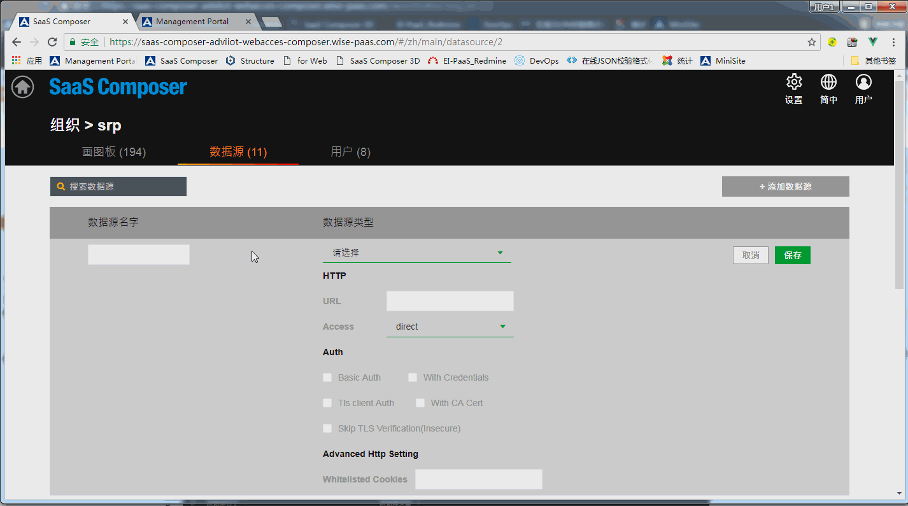

# SimpleJson  

**SaaS Composer 要連接SimpleJson APP的資料需要先在SaaS Composer Management裡面設定好URL的配對**

**連接SimpleJson APP :**

1. SaaS Composer Management進入需要設定的Org後選擇資料來源Tab頁
    點擊 添加資料來源 按鈕打開添加資料來源的配置視窗
2. 設置自訂資料來源名稱，並選擇添加資料來源的類型,這裡選擇 grafana-simple-json-datasource
3. HTTP項中的URL選項處填寫要連接的SImpleJson資料來源的 portal 的 URL，並在前端加上“https://”
4. Access選項設置通過代理或者直接訪問, 這裡選擇direct    Auth項中將With Credentialsx選項勾選
5. 使用這種方式連接，API項無需填寫
6. 點擊保存 
