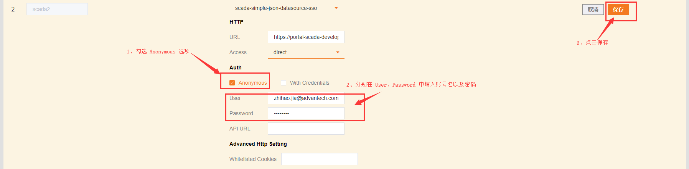
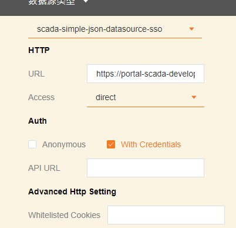

# Anonymous Login
The SaaS Composer data source supports anonymous login. Therefore, users can preview drawings without logging in.

### Instructions: 

1. When connecting the data source with SaaS Composer, select “Anonymous” and deselect “With Credentials”

2.  Enter the username and password in the User and Password fields

3.  Click the Save button without changing any other settings

### Example:

1. Interface for anonymous login: 

2. Interface for normal login:

