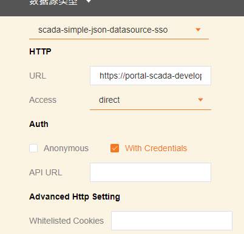

# 匿名登入  

SaaS Composer 的資料來源支援匿名登入功能，即不需要登入WISE-PaaS 也可以預覽圖紙。  

使用方式：  

1.  在資料來源綁定時選擇 Anonymous 並取消 With Credentials  

2.  分別在 User、Password 中填入正確的帳號以及密碼  

3.  其餘配置方式不變，點擊保存按鈕即可  

  

## 示例：  

1、匿名登入綁定介面 

  

2、正常模式綁定介面

  
