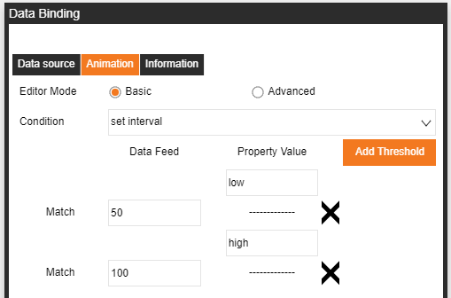

# Data binding
The data source needs to be configured in Management first. See the data source binding chapter for the binding method

## I.	Data source

1.	Bind the data source on the Management page
2.	Select the element and click the button to the right of the attribute you want to bind to open the data binding action page.
If the button is locked and orange, the data is bound. If the button is unlocked and gray, the data has not been bound
3.	Data source page for binding data
 The animation page performs certain logical processing on the data
 The information page displays basic information about this element
4.	Click on data source, select the source of data as the source, and select the specific data you wish to bind
5.	There are two types of data formats
		-Time Series
-Table
6.	After selecting the data, the target field will be automatically generated

## II.	Animation – Basic

There are two ways to implement basic animation:
-set match
-set interval

Set Match:
if the returned data matches, it will return the paired value to the attribute, or check "Direct Feed" to let the data be directly return into the attribute.

Example:
If the return value is equal to 1, "True" will be written into the attribute.                                       If it is equal to 0, "False" will be written into the attribute.

Set Interval:
If the returned data is within the range of the intervals, it will return the paired value to the attribute.

Example: 
If the return value X <= 50, Low will be written into the attribute.
If 50 < X <=100, High is written into the attribute.

Basic will use the corresponding Set match/interval according to the format of the paired attribute.
The example on the left is the format when the color attribute is selected.

## III.	Animation – Advanced

The Advanced Function is a function that provides the user with the option to use standard Javascript to perform logical analysis on the returned data.

The following is an example:
input -> Bound data return value
output -> The value written into the attribute
Processing logic: Each time the return value is incremented by 1 and then written into the attribute.