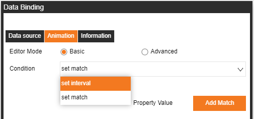
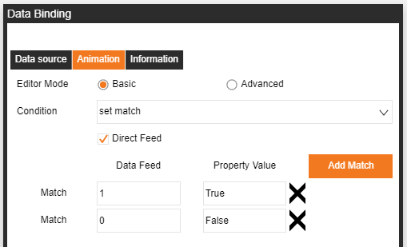
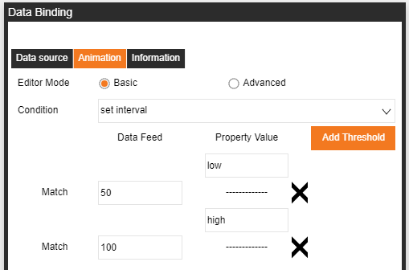
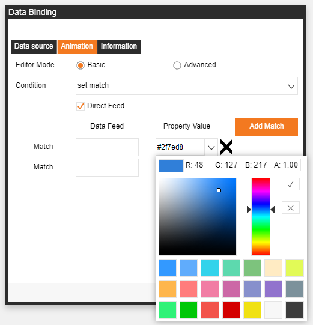
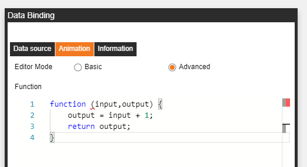

# 資料綁定

需要先在Management裡面綁定好資料來源，綁定方式見資料來源綁定章節

## 1-資料來源

1. 在management 頁面綁定好資料來源
2. 選中元素，點擊想要綁定的屬性右側的小連結按鈕打開資料綁定動作頁面，按鈕為鎖定並且橘色則表示以綁定資料，若為打開並且灰色則表示為綁定數  
3. 資料來源頁面進行綁定資料     
動畫頁面對資料進行一定的邏輯處理     
資訊頁面顯示此元素的基本資訊  
4. 點擊資料來源，在來源處選擇資料來源，並選擇所要綁定的具體資料  
5. 資料格式有兩種          
-Time Serises          
-Table  
6. 選擇好資料之後，目標欄會自動生成

## 2-動畫 -- Basic

   

 動畫Basic有兩種方式：     
      
-set match           
-set interval  

  

Set Match:      
 
可以讓綁定的資料返回值做一次資料配對的邏輯處理，或者可以勾選”Direct Feed”讓資料直接寫入屬性內。  

以下範例:  

返回值如果等於1，則會寫入True到屬性內, 如果等於0，則會寫入False到屬性內  

  

Set Interval:     
  
可以讓綁定好的資料返回值做一次資料邏輯處理。  

以下範例:     

返回值值如果 X <= 50，則會寫入Low到屬性內，  
如果50 < X <=100，則會寫入High到屬性內。  

  

Basic會依照綁定屬性的格式來做相對應的Set match/interval左邊範例是當選取顏色屬性時的格式。  

## 3-動畫 -- Advanced

  

Advanced 的Function是提供給使用者使用標準的Javascript來對返回的資料進行邏輯分析的功能。  

以下範例:  

input -> 綁定好的資料返回值       
output -> 寫入到屬性的值     

業務邏輯：  

每次返回值會加1，再寫入到屬性裡  
