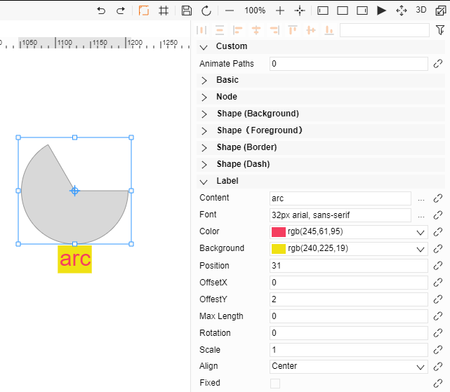
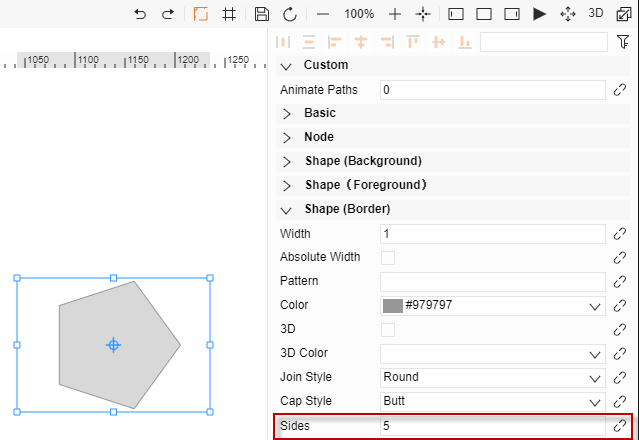

# Elements Attributes

## I.	Sketching elements

1.	Button for creating new displays, icons, and components
2.	Edit
3.	Basic element sketches
They are: irregular shape, circle, rounded rectangle, rectangle, polygon, triangle, star, and arc
4.	Draw text

## II.	Layer properties

1.	Tree diagram of the display
2.	Add and delete layers, select graphics, change the layer properties of the graphics to a new layer, which can be used for classification management
3.	Filter attribute
4.	Can bind functions
5.	JSON format description of the display
6.	Top view

## III.	Basic attributes

1.	Event processing
Handling mouse clicks, entry, removal, etc.
2.	Tag
Element tag; information of the element can be obtained by dataModels.getDataByTag (tag value)
3.	Irregular shape
The graphic can be modified via the drop-down list
4.	Icon collection set

节点属性用来调整元素的大小、位置

1.	Horizontal, vertical, width, height
Adjusts the position and size of the element
2.	Angle, anchor
Adjust the rotation of the element; the anchor is the center of the rotation. The horizontal and vertical anchors are the horizontal and vertical coordinates of the anchor. Use SI derived unit "radian" for angle 
3.	Scale
Adjust the element's horizontal and vertical scale
4.	Crop
Select the crop direction and crop ratio to display a part of the graphic
5.	Snap node
If there is snap option, it will show the snapped target name

Add two colors or gradient colors to one element

First set the "Crop ratio" and "Crop direction" attributes, the preset "Crop ratio" is 1, representing no crop; 
then set "Background" and "Foreground" in the attribute field to see that the node has two colors.

Border and dashed style settings
1.	Dash style
Use an array to set this; the first value is the length of the solid line and the second value is the length of the dashed line.
2.	Dashed line offset value
The dynamic effect of the dashed line is achieved by changing the offset value
3.	Dashed line width
A value of 0 is the same as the width of the border. If it is not 0, it is set according to the width

Text content settings:
1.	Text
The content attributes of a text object, font, color and content attributes can be set and modified.
2.	Position
Preset to directly below the element and can be modified by position and offset properties.
3.	Maximum length
0 means no limit, non-zero means there is a limit, (this is the size of the element).
4.	Angle, scale
Adjust the shape and size of the text.

## IV.	Element special attribute

Special attributes settings within the border of the graphic

1.	Rounded corner rectangle attribute
Radius: The radius of the four arcs of the rectangle
2.	Arc
Start and end angles: Control arc shape
Whether it is closed: Whether the border is connected end to end
3.	Polygon
Number of sides: The number of sides of the polygon; the default is 6; if it is less than 3, the 6-sided shape is displayed.
