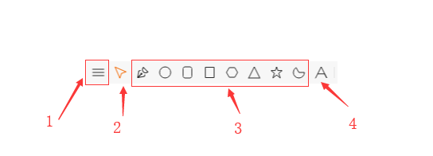
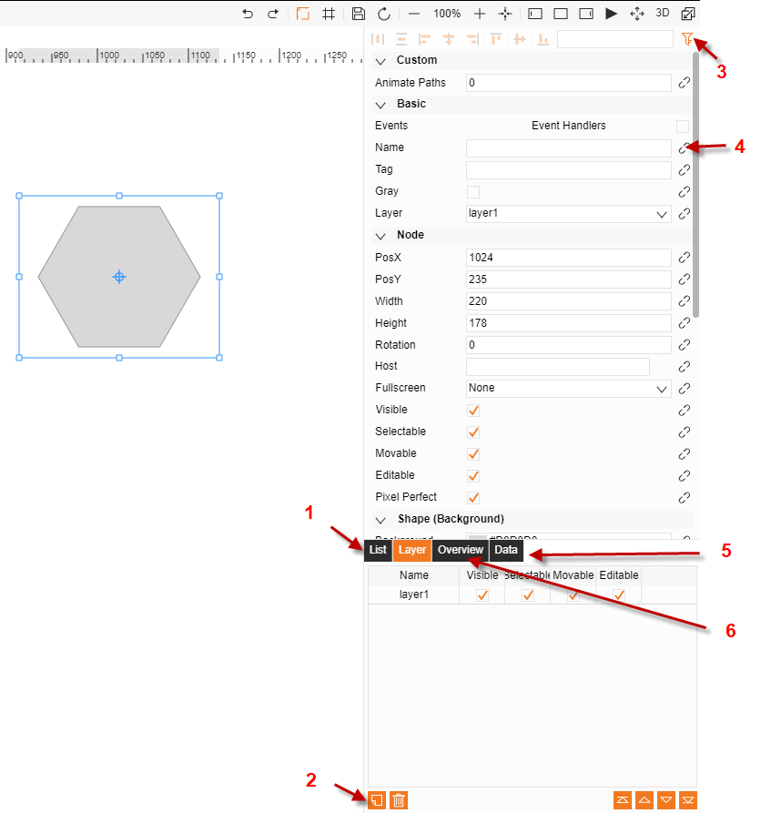
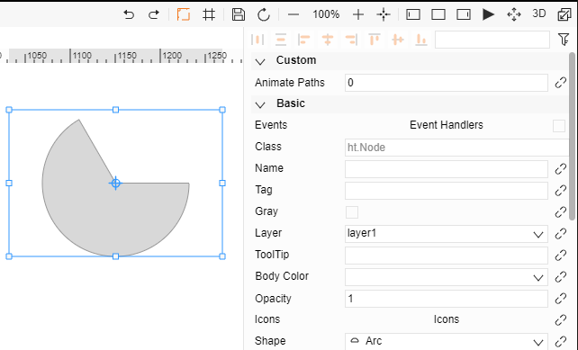
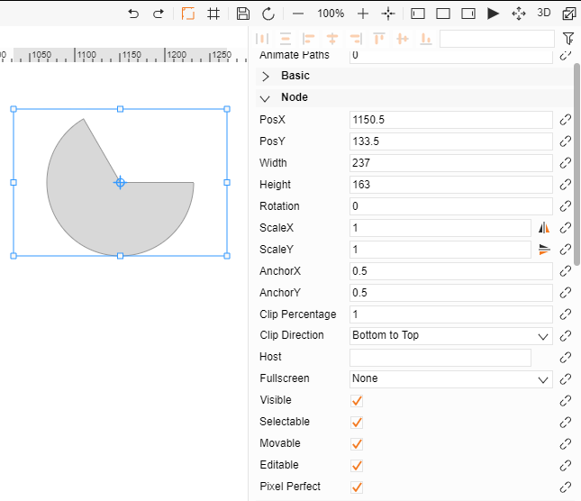
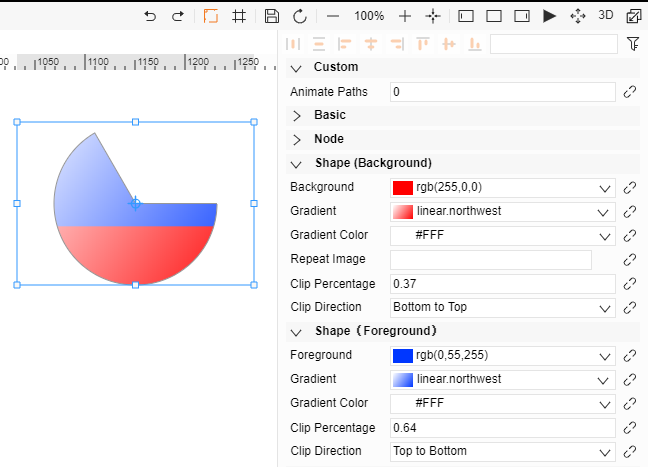
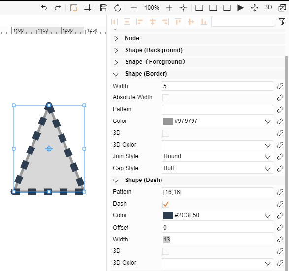
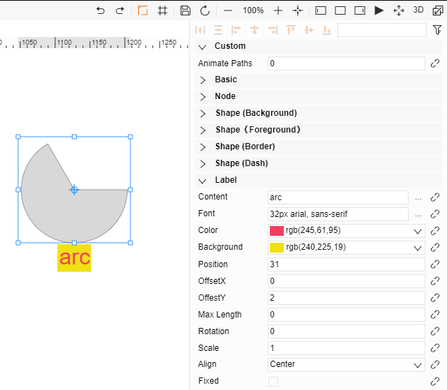
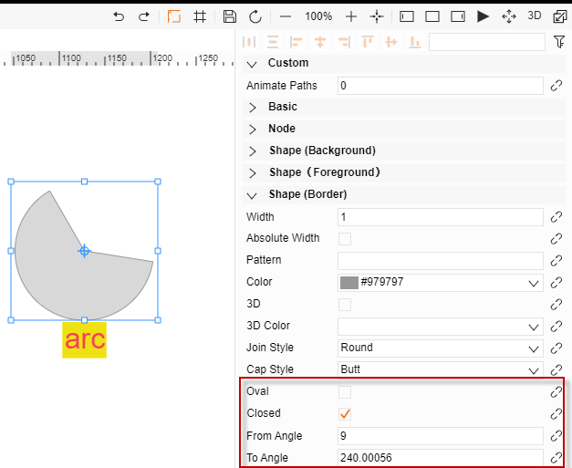
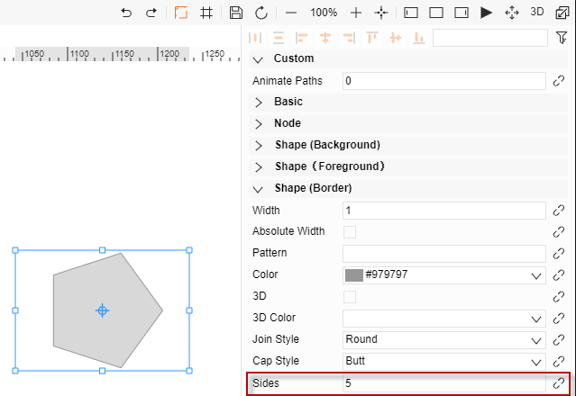
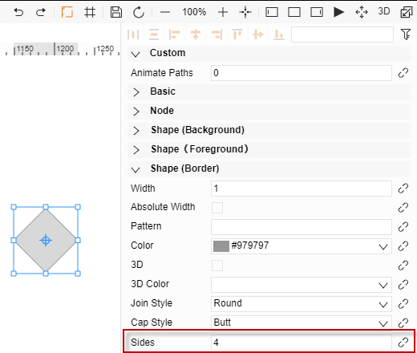

# 1-元素繪製

1. 新增按鈕，用來新建圖紙、圖示、元件
2. 編輯
3. 基本元素繪製        分別是：不規則圖形、圓形、圓角矩形、矩形、正多邊形、三角形、星形、圓弧形
4. 文本繪製

# 2-圖層屬性

1. 圖紙的樹狀關係圖
2. 增加、刪除圖層, 選則圖形, 將圖形的圖層屬性修改成    新建的圖層, 可用做分類管理
3. 過濾屬性
4. 可綁定函數
5. 圖紙的JSON格式敘述
6. 俯視圖

# 3-基礎屬性

1. 事件處理       
處理元素的滑鼠點擊、進入、移出等事件
2. 標籤       
元素標籤，可以通過dataModels.getDataByTag(標籤值)獲取該元素資料
3. 不規則圖形       
可通過下拉清單修改圖形
4. 圖示集

節點屬性用來調整元素的大小、位置

1. 橫、縱坐標、寬度、高度       
調整元素的位置和大小

2. 角度、錨點       
調整元素的旋轉，錨點為旋轉的中心點。橫、縱錨點為錨點的橫、縱坐標，旋轉數值皆以弧度計算

3. 縮放        
調整元素橫縱縮放

4. 裁切        
選擇裁切方向和裁切比例來顯示部分圖形5. 吸附節點        如有吸附會顯示所吸附的目標

一個元素上添加兩種顏色/漸進色功能
首先設置“裁切比例”和“裁切方向”兩個屬性，預設“裁切比例”為1，為不裁切；然後設置屬性欄中的“背景”和“前景”則可以看到該節點具有兩種顏色

邊框和虛線樣式設置

1. 虛線樣式        
一個陣列來設置，第一個值為實線長度，第二個值為虛線長度。

2. 虛線偏移值        
虛線的動態效果就是需要偏移值的改變

3. 虛線寬度        
值為0，則和邊框寬度一致，不為0，則按照寬度自行設置

文本內容設置：

1. 文本        
內容屬性設置顯示的文字內容，字體、顏色屬性來修改文字樣式

2.  位置       
預設處於元素正下方，可通過位置、偏移屬性來修改

3. 最大長度       
0代表不限制，非0代表限制，（此處為圖元大小）

4. 角度、縮放        
調整文本顯示的形態和大小

# 4-元素特殊屬性

特殊屬性都屬於圖片邊框內

1. 圓角矩行特殊屬性        
半徑：矩形四個出圓弧的半徑值

2. 圓弧：        
起始、結束角度：控制圓弧形狀        
是否閉合：邊框是否頭尾相連

3. 正多邊形        
邊數：多邊形的邊數，默認為6，若小於3則顯示6邊形
