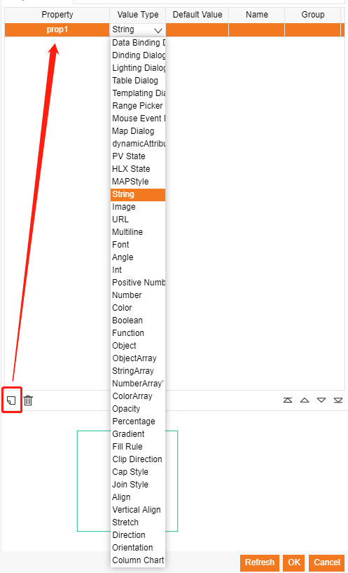

# create components  

- Name: Component name  
- Events: Set default event    
- Width: Set default width    
- Height: Set default height  
- Background: Set default background color  
- Path: file path  
- Snapshot URL: (default is preview snapshot)  
- Property List: Add private property  
- Preview window: preview canvas  
- main function: Write javascript canvas script  

## function  

### Parameter  

(g, rect, comp, data, view)  

|  parameter   | info                                 |
|  ----------  | -----------------------------------  |
|  g           | equal canvas.getContext("2d")        |
| rect         | Drawing area { x, y, width, height } |
| comp         | component property, comp.getValue()  |
| data         | In Display, equal node object itself |
| view         | graphView                            |

### Drawing area  

- rect.x, 
- rect.y, 
- rect.width, 
- rect.height  

### Add Private 

  

Use `comp.getValue` can read private properties in main function.  

## Write function  

Example:  

	var x = rect.x;
	var y = rect.y;
	var width = rect.width;
	var height = rect.height;
	var centerX = x + rect.width/2;
	var centerY = y + rect.height/2;
	var background = comp.getValue('background');
	var circleColor = comp.getValue('circleColor');
	var radiusRate = comp.getValue('radiusRate');
	var radius = Math.min(rect.width/2,rect.height/2) * radiusRate;

    // draw background
	if (background) {
	    g.fillStyle = background;
	    g.beginPath();
	    g.rect(x, y, width, height);
	    g.fill();
	}
	
	g.beginPath();
	g.strokeStyle = circleColor;
	g.arc(centerX, centerY, radius, 0, 2 * Math.PI);
	g.stroke();

## Add Component to Symbol  

Create Symbol.  

  

Add Component to symbol

  

Set Binding Data  

  

  