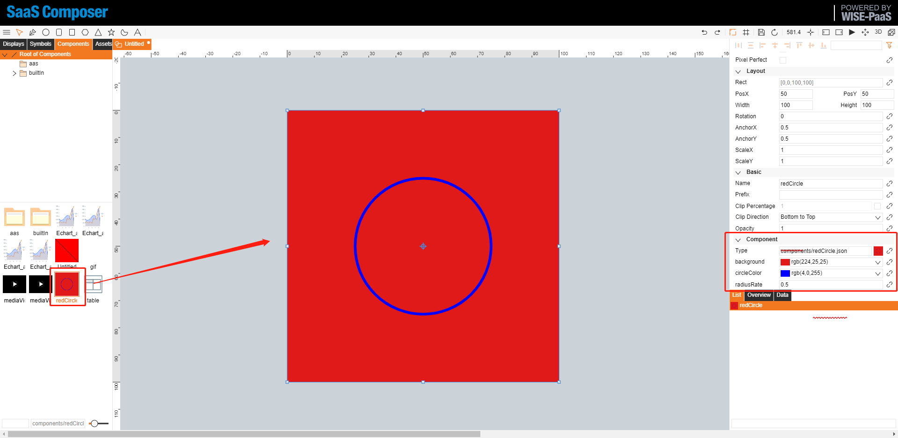
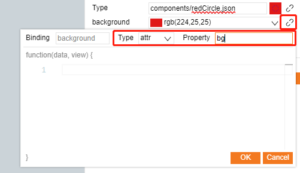
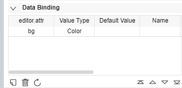

# 新增組件 components  

- Name: 組件名稱  
- Events: 預設事件    
- Width: 預設繪圖區寬度    
- Height: 預設繪圖區高度  
- Background: 設定預設背景顏色  
- Path: 存檔路徑  
- Snapshot URL: (預設用預覽做截圖)  
- Property List: 添加私有屬性  
- Preview window: 預覽視窗  
- main function: 撰寫 canvas script  

## function  

### 參數  

(g, rect, comp, data, view)  

|  parameter   | info                                 |
|  ----------  | -----------------------------------  |
|  g           | equal canvas.getContext("2d")        |
| rect         | Drawing area { x, y, width, height } |
| comp         | component property, comp.getValue()  |
| data         | In Display, equal node object itself |
| view         | graphView                            |

### 繪圖區範圍  

- rect.x, 
- rect.y, 
- rect.width, 
- rect.height  

### 私有參數 

  

使用 `comp.getValue` 可以在左邊函式中，讀取私有參數.  

## 撰寫組件 Script  

範例:  

	var x = rect.x;
	var y = rect.y;
	var width = rect.width;
	var height = rect.height;
	var centerX = x + rect.width/2;
	var centerY = y + rect.height/2;
	var background = comp.getValue('background');
	var circleColor = comp.getValue('circleColor');
	var radiusRate = comp.getValue('radiusRate');
	var radius = Math.min(rect.width/2,rect.height/2) * radiusRate;

    // draw background
	if (background) {
	    g.fillStyle = background;
	    g.beginPath();
	    g.rect(x, y, width, height);
	    g.fill();
	}
	
	g.beginPath();
	g.strokeStyle = circleColor;
	g.arc(centerX, centerY, radius, 0, 2 * Math.PI);
	g.stroke();

## 圖標中添加組件  

新增圖標:  

  

圖標中添加組件:  

  

數據綁訂:  

  

  
