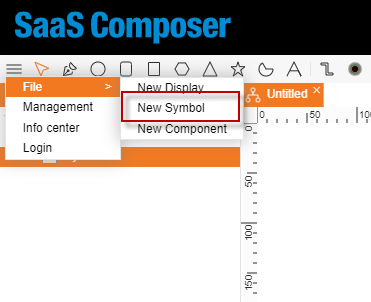
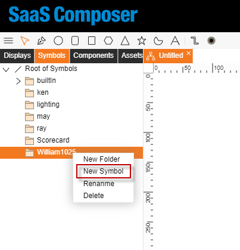
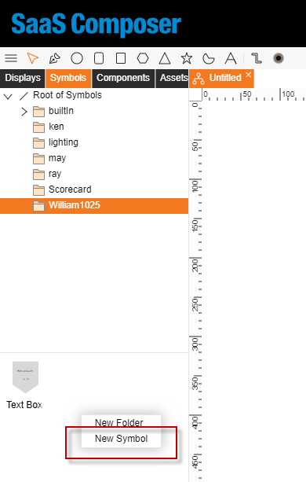

# Create Symbol
**There are 3 ways to create Symbol:**

1.	In the upper left corner, there is a button with three bars. 
Click this button and move the mouse to "**File**", then move the mouse to "**New Symbol**" and click it to create a blank icon screen.

2.	Select the destination folder, right click, move the mouse to "**New Symbol**", and click it to create a blank icon screen.

3.	Under the destination folder, in any blank space, right click and then move the mouse to "**New Symbol**" and click it to create a blank icon screen.

