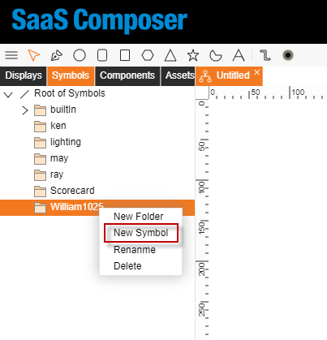

# 創建圖標  
**創建圖標**共有3種方式：
1. 左上角有一個顯示為 “三條橫杠” 的按鈕，點擊    此按鈕，滑鼠移動到“檔”，接著將滑鼠移動到    “新建圖圖標” 上，點擊即可創建一張空白的圖示。  

2. 選擇目的檔案夾，點擊右鍵，將滑鼠移動到     “新建圖標”上，點擊即可創建一張空白的圖示。  

3. 在目的檔案夾下，任意空白處，點擊右鍵    接著講滑鼠移動到 “新建圖標” 上，點擊即    可創建一張空白圖示。  

