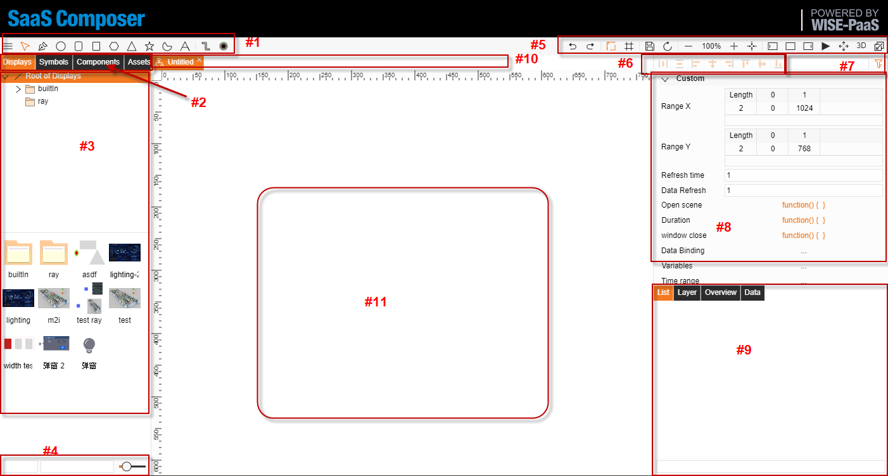

# Editor screen introduction

1.	Simple sketching tools, units, and objects
2.	The four main file categories are:    
Displays, Symbols, Components, Assets
3.	A directory structure that corresponds to the selected file type
4.	Relative path of the selected file
5.	File, interface related functions and operations
6.	Hot keys for quick assignment of sketch components
7.	Object attributes search function
8.	Object attribute field
9.	File content list and other attributes
10.	List of opened and edited files
11.	File edit and modification screen

