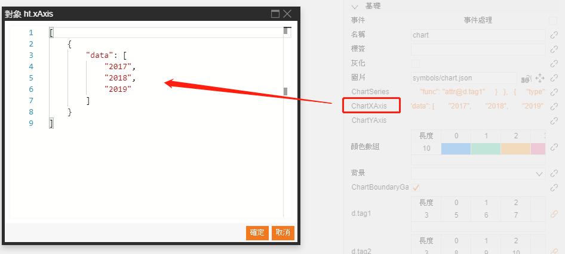

# Symbols  

# columnChart & pieCahrt    

symbols > chart 

**In Editor**  

**value**: Use format-type (`F-Type`) `Array` for dataBinding.  

    [ 15, 20, 25]  

**Color**:  

    [
        "rgb(51,153,255)",
        "rgb(242,83,75)",
        "rgb(240,225,19)"
    ]

  

# Chart  

**1. chartSeries**  

    [
        {
            "type": "bar",
            "barWidth": 0.4,
            "data": [
                10,
                30,
                20
            ]
        },
        {
            "type": "line",
            "data": [
                40,
                50,
                10
            ]
        }
    ]

  

**type = "line"**  

    type: 'line',
    name: 'series name',
    data: // Array data or you can set { func: 'attr@lineData' } and use data.a('lineData') get data from other attribute.  
    smooth:  // set 0~1, default value is 0.4.
    connectNulls：false, // set true to connect null value point.
    visible: // set visible, will effect y-asix value.
    areaStyle: 
        { 
            color: // area color, can use linear gradient.
        },
    lineStyle: 
        {
            color: // line color.
            pattern: [16, 16] // line style.
            width: 2, // line width.
        },
    itemStyle: 
        {  // points style  
            size: 0, // points radius
            activeSize: 3, // active points radius.
            background: // points color.
            borderWidth: 1, // points border width.
            borderColor: // points border color.
            activeBackground: // active points color, default is background.
            activeBorderWidth: 1, // active points width, default is borderWidth.
            activeBorderColor: // active points border color, default is borderColor.
                /**
                * visible function
                * point: coordinate
                * index: series index
                * seriesData: series data
                * active: active
                * data: graph data
                * view: graph view
                */
            visible: function(point, index, seriesData, active, data, view)
        }

**type = "bar"**  

    type: 'bar',
    name: 'series name',
    data:   // Array data or you can set { func: 'attr@lineData' } and use data.a('lineData') get data from other attribute.  
    visible: // set visible, will effect y-asix value.
    color: // color, can use linear gradient.
    shadow: 
        { // default false.
            color: // color
            opacity: // opacity
            offsetX: // X-offset
            offsetY: // Y-offset
            blur: // blur
        },
    drawBar: // use canvas draw custom bar, function(g, value, rect, color, data, view)  
                 //     g: canvas.
                 //     value: value.
                 //     rect: area.
                 //     color: color.
                 //     data: graph data.
                 //     view: graph view.

**2. chartXAxis**  

    [
        {
            "data": [
                "2017",
                "2018",
                "2019"
            ]
        }
    ]

  

Property：  

    {
        type: // 
        data: // Array data or you can set { func: 'attr@xAxisData' } and use data.a('xAxisData') get data from other attribute.
        show: // true / false for show / hide.
        position: // top / bottom, first axis default is bottom others is top.
        axisLine: { // axis line
            show: true, // visible.
            width: 1, // line width.
            color: 'rgb(61,61,61)', // color
        },
        axisTick: { // tick
            show: true, // visiable
            color: 'rgb(61,61,61)',// tick color
            length: 5 // width
            interval: // tick interval.
        },
        axisLabel: { // label
            show: true, // visible.
            font: '12px arial', // font style.
            color: 'rgb(61,61,61)', // color.
            interval: // label interval.
        },
        splitLine: { // split line
            show: true, // visible
            color: 'rgb(61,61,61)', // line color
            width: 1 // line width
            interval: // line interval
            pattern: '#cccccc'// line style
        },
        dataZoom: { // zoom, time interval
            barBackground: '#eee', // background color.
            barValueBackground: 'rgb(51,153,255)', // bar value color
            barWidth: Math.min(12, width), // bar width
            barBorderRadius: 0, // bar border
            min: , // minimum
            max: , // maximum
            sliderOffsetX: 0, // slider bar offset X.
            sliderOffsetY: 0, // slider bar offset Y.
            sliderWidth: 5, // slider bar width.
            sliderHeight: 14, // slider bar hight.
            sliderBackground: '#32D3EB', // slider bar background color.
            sliderBorderColor: '#32D3EB', // slider bar border color.
            sliderBorderWidth: 1, // slider bar border width.
            sliderBorderRadius: 0, // slider bar border radius.
            sliderImage, // slider bar image.
            sliderVisible, // slider bar visiable.
            zoomIncrement: 0.05, // slider bar zoom step.
            onChange: function(oldValue, newValue, data, view) // zoom chagne event
        },
        markLines: [ // mark lines
            value: // value (necessary)
            color: // color (necessary),
            lineStyle: { 
                pattern: [4, 4] // line style.
                color: // line color.
                width: 1// line width
            },
            itemStyle: { // 起始点样式
                backgrond: // 点颜色,默认使用基础颜色
                radis: 2 // 点半径
            },
            labelStyle: {
                font: '12px arial', // font style
                color: // color
            },
            arrowStyle: {
                color: // arrow color
            }
        ]
    }

**3. chartYAxis**  

    [
        {
            "axisTick": {
                "color": "#F00"
            },
            "axisLabel": {
                "color": "rgb(0,255,0)"
            },
            "splitLine": {
                "color": "#00F"
            }
        }
    ]

    {
        type: // 
        show: // visiable
        position: // left / right, first axis default is left others is right.
        size: // y space width
        axisLine: { 
            show: true, // visiable
            width: 1, // line width
            color: 'rgb(61,61,61)', // color
        },
        axisTick: { // axis tick
            show: true, // visiable
            color: 'rgb(61,61,61)',// tick color
            length: 5 // tick length
            interval: // tick distance interval 
        },
        axisLabel: { // 
            show: true, // visiable
            font: '12px arial', // font style
            color: 'rgb(61,61,61)', // color
            interval: // label distance interval ,
            formatter: // foramt text function(value, data, view)
        },
        splitLine: { // grid line
            show: false, // visiable
            color: 'rgb(61,61,61)', // color
            width: 1 // width
            interval: // grid distance interval 
            pattern: '#cccccc'// line style
        },
        dataZoom: { //  zoom, time interval
            barBackground: '#eee', // background color.
            barValueBackground: 'rgb(51,153,255)', // bar value color
            barWidth: Math.min(12, width), // bar width
            barBorderRadius: 0, // bar border
            min: , // minimum
            max: , // maximum
            sliderOffsetX: 0, // slider bar offset X.
            sliderOffsetY: 0, // slider bar offset Y.
            sliderWidth: 5, // slider bar width.
            sliderHeight: 14, // slider bar hight.
            sliderBackground: '#32D3EB', // slider bar background color.
            sliderBorderColor: '#32D3EB', // slider bar border color.
            sliderBorderWidth: 1, // slider bar border width.
            sliderBorderRadius: 0, // slider bar border radius.
            sliderImage, // slider bar image.
            sliderVisible, // slider bar visiable.
            zoomIncrement: 0.05, // slider bar zoom step.
            onChange: function(oldValue, newValue, data, view) // zoom chagne event
        }
    }

**4. Example. data binding**  

Edit symbols property add `d.tag1`, `d.tag2` for two series data.  

  

Set CahrtSeries  

    [
        {
            "type": "bar",
            "barWidth": 0.4,
            "data": {
                "func": "attr@d.tag1"
            }
        },
        {
            "type": "line",
            "data": {
                "func": "attr@d.tag2"
            }
        }
    ]

  

`d.tag1` is bar, and `d.tag2` is line.  

  

Use format-type (`F-Type`) `Array`.

  
