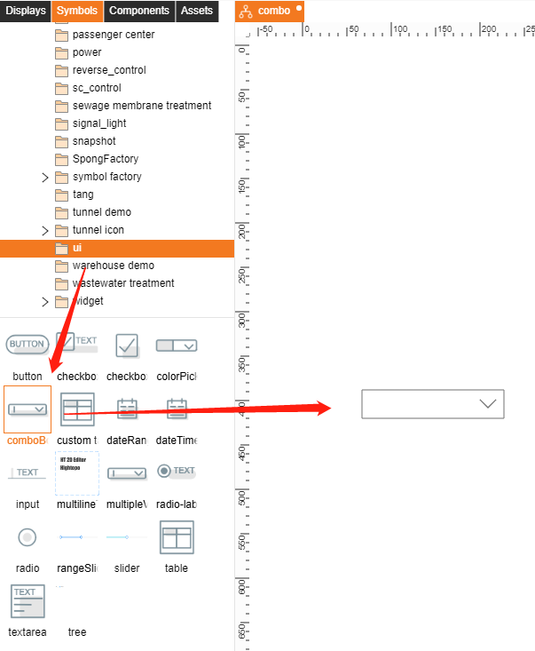
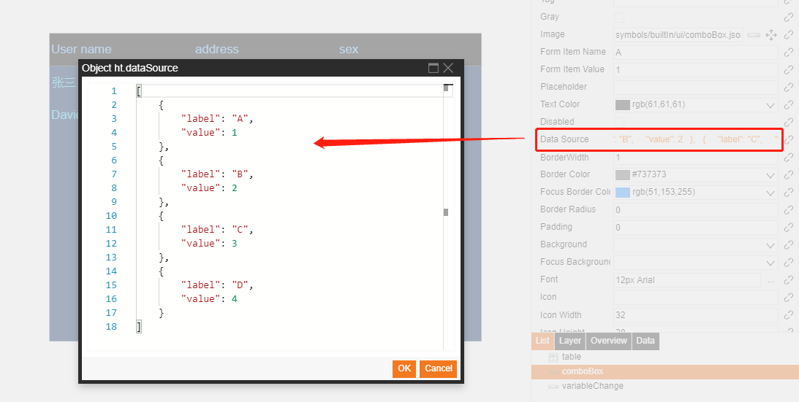

# Symbols  

## Combo box  

**In Editor**  
1. Add combo box.  

  

2. Set select option in **Data Source**  

    [
        {
            "label": "A",
            "value": 1
        },
        {
            "label": "B",
            "value": 2
        },
        {
            "label": "C",
            "value": 3
        },
        {
            "label": "D",
            "value": 4
        }
    ]

Note.  
- Given "**tag**" name then you can use `dataModel.getDataByTag('tag').a('ht.value')` to get combo box value.

  