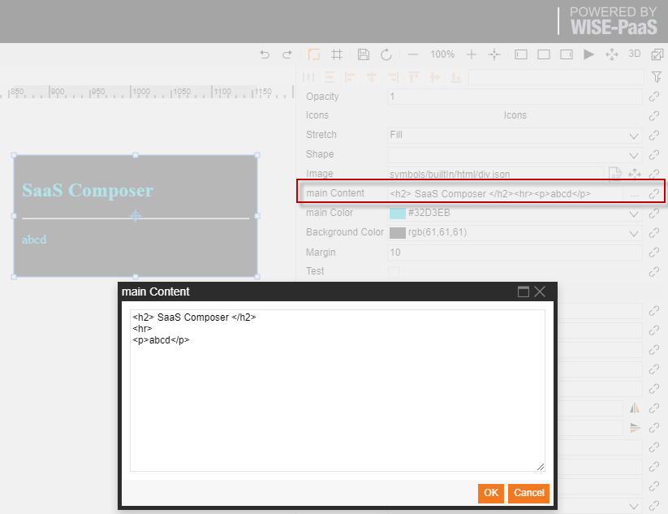
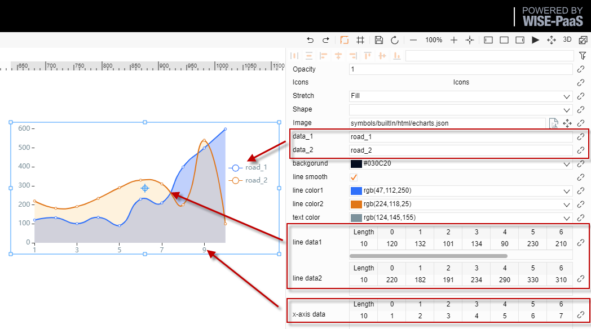
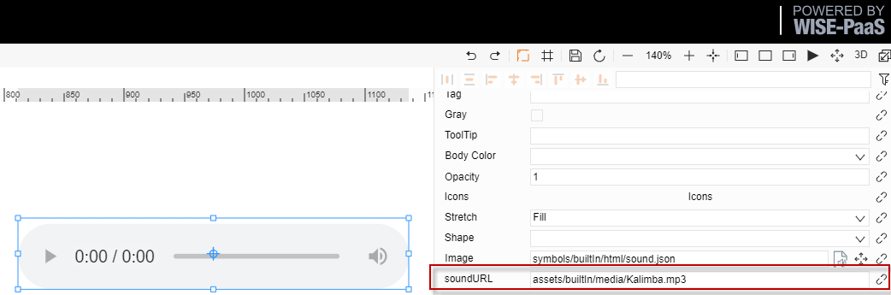
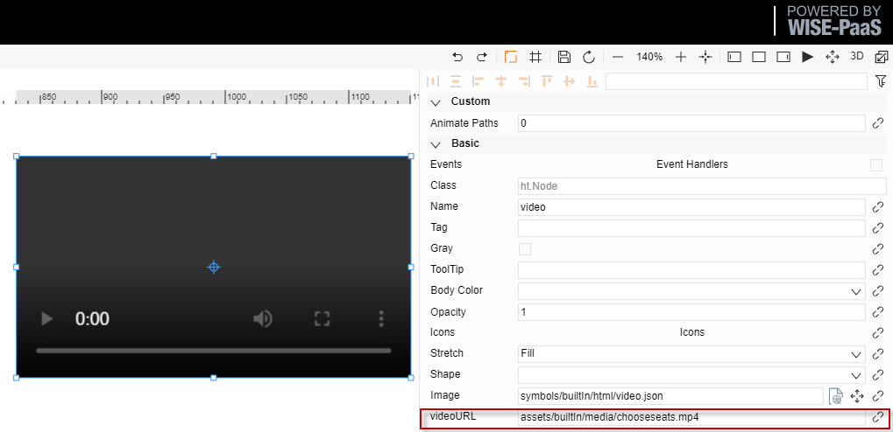
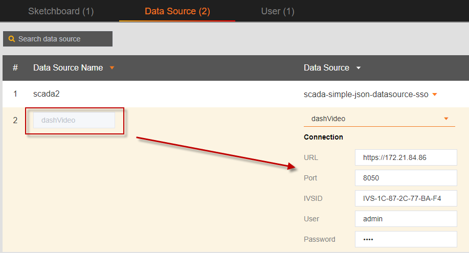

# HTML Symbol
There are HTML mask icons in the SaaS Composer's builtIn file:
There are six types of icons:
- Div
- Image
- Echarts
- Sound
- Video
- Dashvideo

## I. Div

"div" icon function:   
Embed a "**div**" content inside using the "**div**" icon   
Instruction for using parameters:
1.	main content: div content
For example: <h2> SaaS Composer </h2>  
             
                              
	     

   
2. main color: The color of the div content   
3. Background Color: div background color   
4. Margin: The margin width of the divdiv 
   
## II. Echarts

Echarts icon function:   
Embed a table with the echarts iconInstruction for using parameters:
1.	data_1, data_2: The names of two data segments
2.	line smooth:  Polyline, curve selection
3.	line color1, line color2: The colors of the two data segments
4.	text color: The color of the text
5.	line data1, line data2:  Fill in the tabular form with the two data segments
6.	x-axis data:  X-axis data value

# III. Image, Sound, Video
Use the image, sound, and video icons to embed the corresponding icons, audio and video.
Parameter description:
Note: Because the file is stored in the asset, due to permission issues, the default org id=1 but the URL will not be displayed. If the user is operating under other orgs, the corresponding org id must be filled in. org_id is in the current url of the editor
1. Default org URL: assets/builtIn/media/chooseseats.mp4
2. Other org URLs: assets/builtIn/media/chooseseats.mp4?org_id=3
3. Example: Use image icon to embed gif picture.

# IV. Dashvideo

Dashvideo icon function:  
Instructions for using the Dashvideo icon to embed a Dashvideo video:   
1. Configure the data source of Dashvideo on the management configuration page, as shown in the figure on the right.   
2. Drag the Dashvideo icon from the html folder in builtIn into the display.
3. Click the data binding link to the right of the dashinfo attribute to open the binding interface.  
4. Select a Dashvideo data source that is already configured   
5. Fill in the channel number and click Save.  
6. URL, USER, PASSWORD, IVSID information will be filled in automatically and cannot be changed.

   

