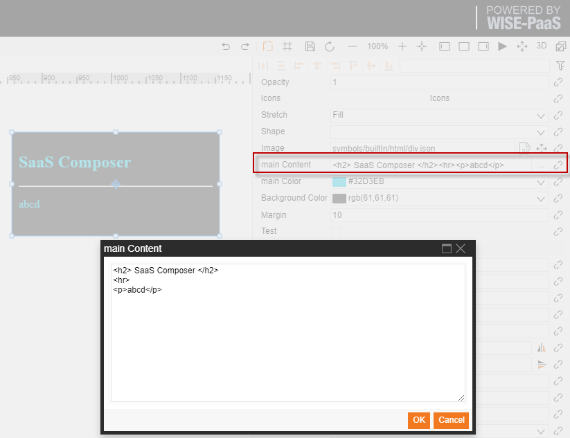
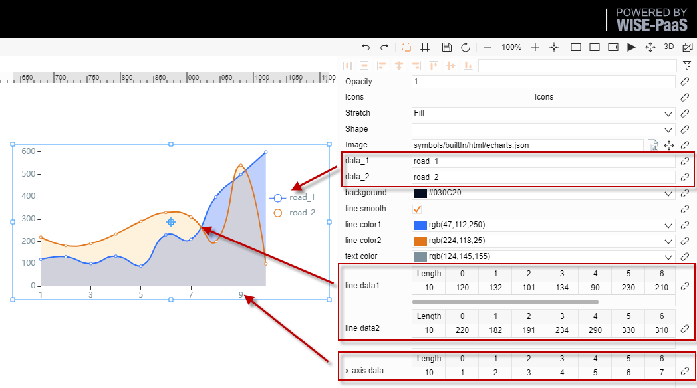
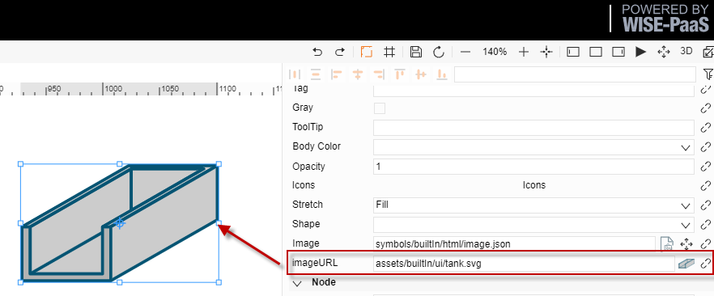
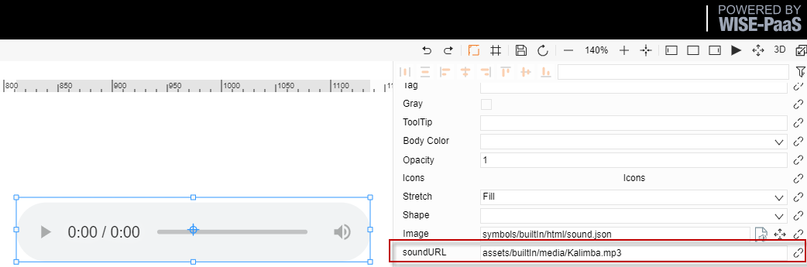
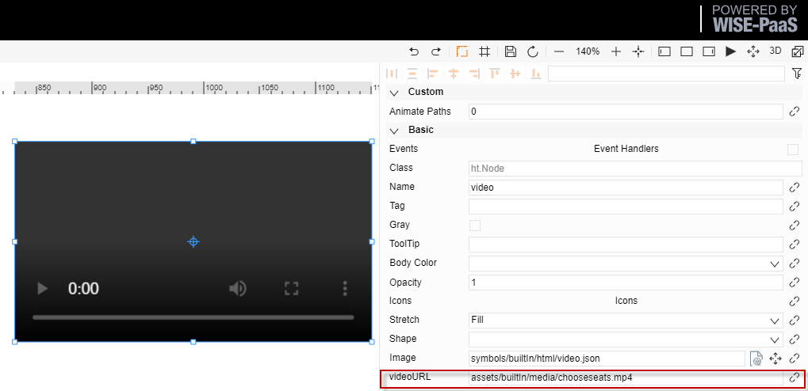
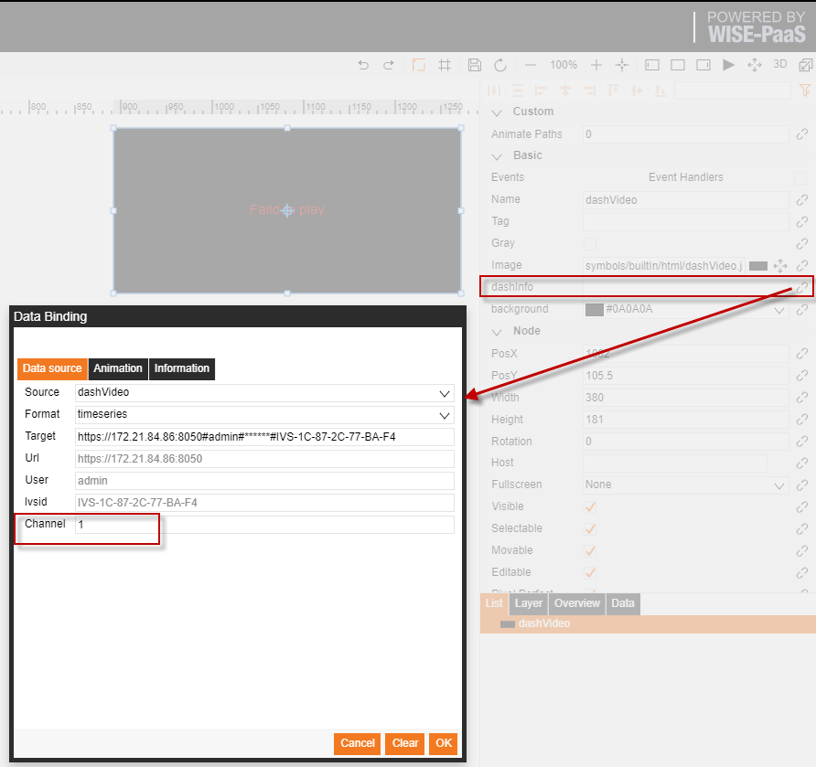
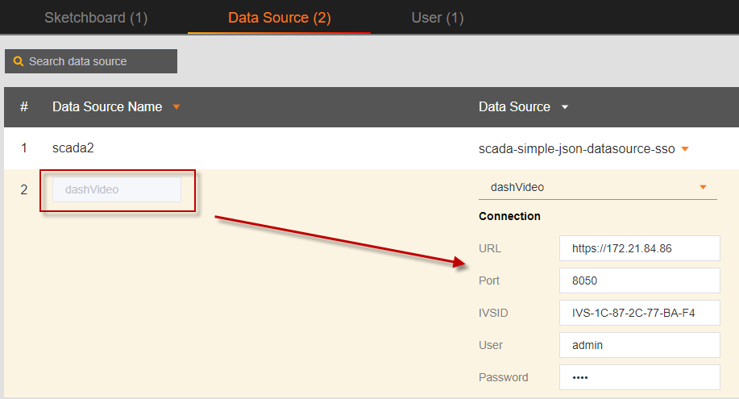

# HTML圖標  

SaaS Composer 的 builtIn 檔中有封裝的 html 圖示：  
圖示類型共有六種：  

- Div
- Image
- Echarts
- Sound
- Video
- Dashvideo

## I. Div

div 圖示功能：  

- 使用 div 圖示來內嵌入一個 div 

內容參數使用說明：  

1. main content：div的內容如：  

    <h2> SaaS Composer </h2>
    

    

2. main color：div 內容的顏色
3. Background Color：div 背景顏色
4. Margin：div 的 margin寬度
   
## II. Echarts

Echarts 圖示功能：  

使用 echarts 圖示來內嵌入一個 表格參數使用說明：  

1. data_1、data_2：兩條數據的名稱  
2. line smooth：折線、曲線選擇   
3. line color1、line color2：兩條資料線段的顏色  
4. text color：文本顏色  
5. line data1、line data2：表格形式填入兩條資料  
6. x-axis data：橫坐標的數據  

# III. Image, Sound, Video

image、sound、video 圖示功能：  

- 使用 image、sound、video 圖示來內嵌入對應的圖示、

音訊和視頻參數使用說明：  

- URL：當前嵌入內容的路徑  

# IV. Dashvideo

dashvideo圖示功能:  

使用 dashvideo圖示來內嵌入一個dashvideo視頻使用方法說明：

1. 在management配置頁面配置dashvideo的資料來源，方式如下圖
2. 將 builtIn 中 html 資料夾下的 dashvideo 圖示拖入圖紙
3. 點擊 dashinfo 屬性右側的資料綁定連結打開綁定介面
4. 選擇配置好的 dashvideo 資料來源
5. 填寫 channel 號，點擊保存即可
6. URL、USER、PASSWORD、IVSID資訊將自動填好且不可改變

   

