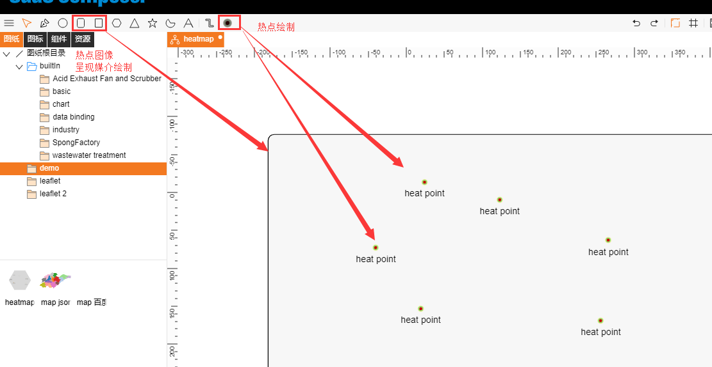
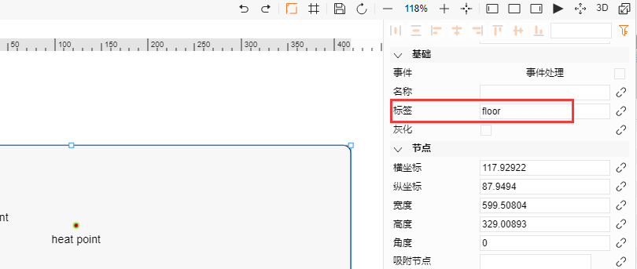
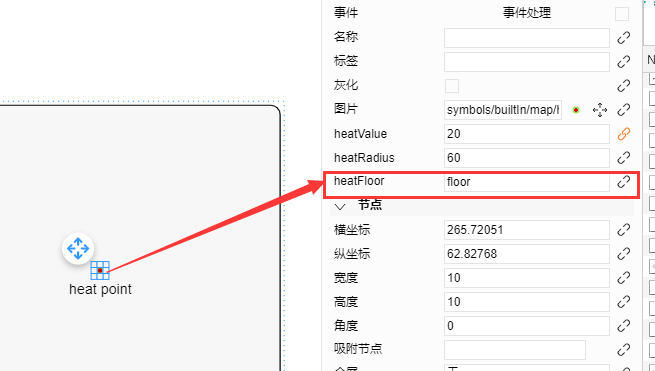
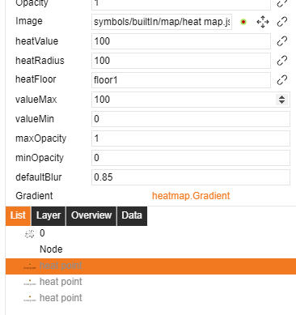
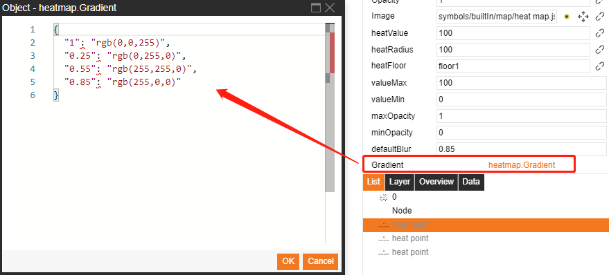
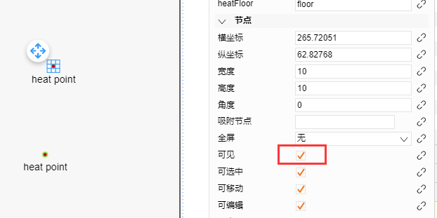
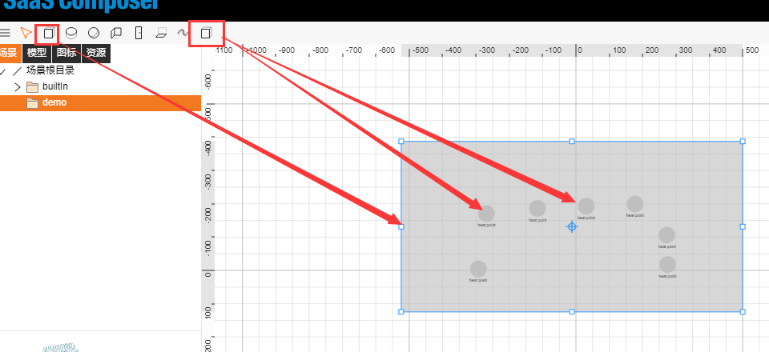
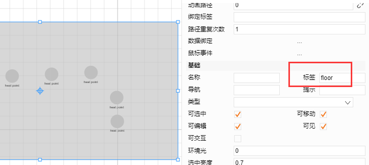
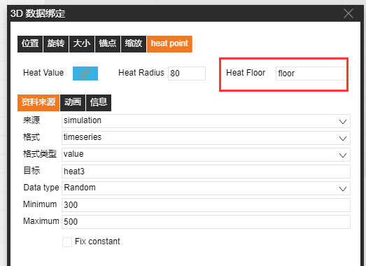
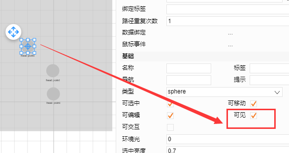

# 2D heat map

1.	Draw heat points and create the heat map display medium: Select the heat points at the upper-right corner to draw heat points on the drawing sheet. Select the round rectangle or rectangle to create a heat map display medium (the heat map will be displayed at the location of the medium).

2.	Heat map binding:

a) Create labels for the heat map display medium

b) Fill in the “HeatFloor” field of the heat point with the revised label content 

3.	Heat point property

`heatValue`: Current heat point value, which indicates the brightness of the heat points.  
`heatRadius`: Radius of the heat map.  
`heatFloor`: Area show heatpoints.  
`valueMax`: Upper bound of value.  
`valueMin`: lower bound of value.  
`maxOpacity`: The maximal opacity the highest value.  
`minOpacity`: The minimum opacity the lowest value.  
`deafultBlur`: [0,1] the blur factor is, the smoother the gradients will be.  
`Gradient`: An object that represents the gradient (syntax: number string [0,1] : color string)  

  
  

4.	Hide the heat points to preview the heatmap

# 3D heat map

1.	Draw heat points and create the heat map display medium: Select the heat points at the upper-right corner to draw heat points on the drawing sheet. Select hexahedron to create a heat map display medium (the heat map will be displayed at the location of the medium, and the height of the hexahedron can be adjusted).

2.	Heatmap binding:

a) Enter the label of the heat map display medium on the selected surface of the hexahedron.

b) Select a heat point and click the figure to the right of the heat point to bind it. Select a heat point and fill in the “**HeatFloor**” field with the revised label content. 

3.	Heat point property  

`heatValue`: Current heat point value, which indicates the brightness of the heat points.  
`heatRadius`: Radius of the heat map.  
`heatFloor`: Area show heatpoints.  
`Max`: Upper bound of value.  
`Min`: lower bound of value.  
`max Opacity`: The maximal opacity the highest value.  
`min Opacity`: The minimum opacity the lowest value.  
`Gradient`: An object that represents the gradient (syntax: number string [0,1] : color string)  

4.	Hide the heat points to preview the heatmap

