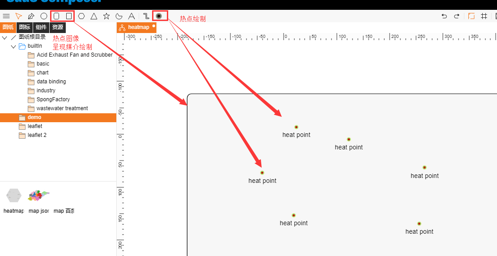
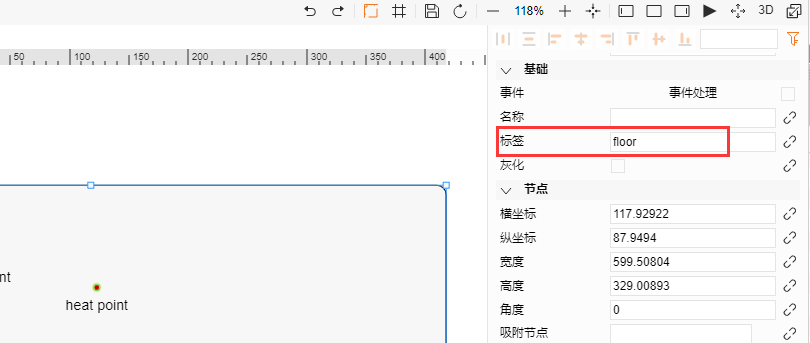
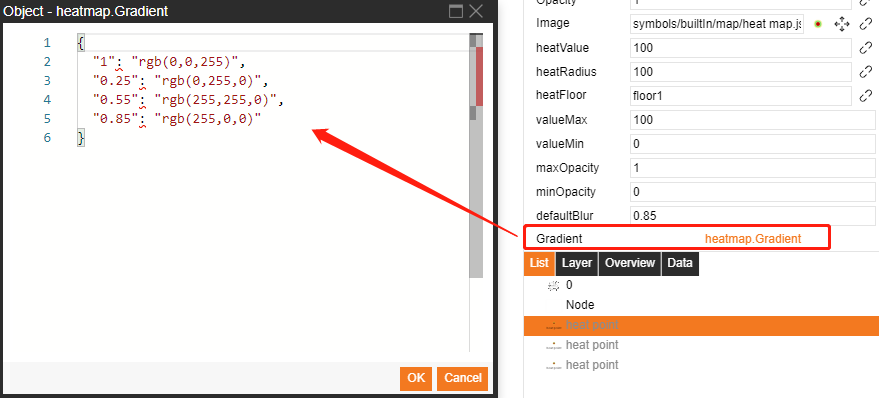
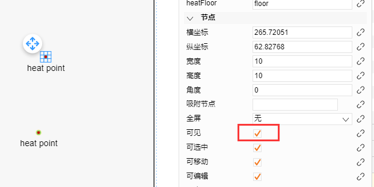
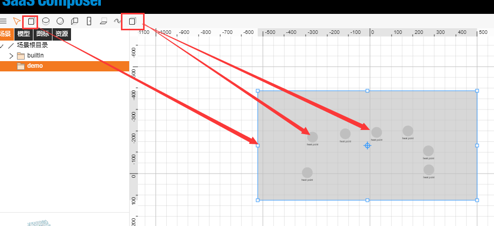
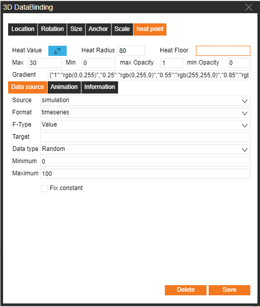

# 2D 熱點圖  

1.	熱點以及熱點圖像呈現媒介繪製：選擇右上角的熱點，在圖紙中繪製出熱點；選擇圓矩形體或者矩形體繪製熱點圖像呈現媒介（熱點圖像將呈現在該媒介所在位置） 

2.	熱點圖像綁定：  

a) 填寫熱點圖像呈現媒介標籤  

b) 將改標籤內容填寫在熱點的 HeatFloor 屬性中  

3.	熱點屬性  

`heatValue`：當前熱點的數值，數值不同顏色深淺不同。  
`heatRadius`：熱點圖像的半徑。  
`heatFloor`: 顯示投影熱點的區域。  
`valueMax`: 設定數值上界。  
`valueMin`: 設定數值下界。  
`maxOpacity`: 最大值的透明度。  
`minOpacity`: 最小值的透明度。  
`deafultBlur`: [0,1]模糊因子決定漸層色漸變的平滑程度。  
`Gradient`: 設置熱點圖的光圈顏色，數值為[0,1]，數值大的在光圈內側，可以同時設置很多顏色。  

  
  

4.	將熱點隱藏即可預覽  

# 3D 熱點圖  

1.	熱點以及熱點圖像呈現媒介繪製：選擇右上角的熱點，在圖紙中繪製出熱點；選擇六面體繪製熱點圖像呈現媒介（熱點圖像將呈現在該媒介所在位置，六面體可調整高度）

2.	熱點圖像綁定：  

a) 選中六面體填寫熱點圖像呈現媒介標籤  

b) 選中熱點，點擊右側資料綁定，選中heat point，將改標籤內容填寫在HeatFloor 屬性中   

3.	熱點屬性   

`Heat Value`：當前熱點的數值，數值不同顏色深淺不同。  
`Heat Radius`：熱點圖像的半徑。  
`Heat Floor`: 顯示投影熱點的區域。  
`Max`: 設定數值上界。  
`Min`: 設定數值下界。  
`max Opacity`: 最大值的透明度。  
`min Opacity`: 最小值的透明度。  
`Gradient`: 設置熱點圖的光圈顏色，數值為[0,1]，數值大的在光圈內側，可以同時設置很多顏色。   

4.	將熱點隱藏即可預覽  

