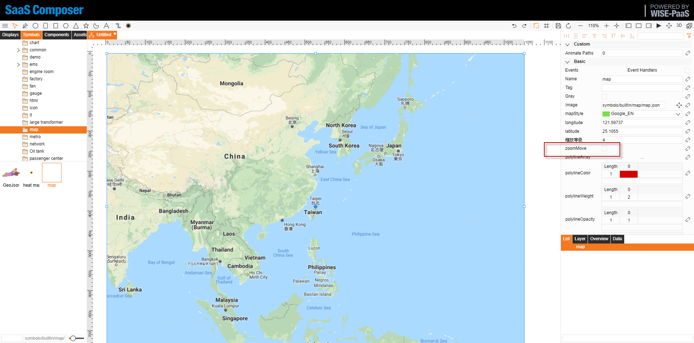
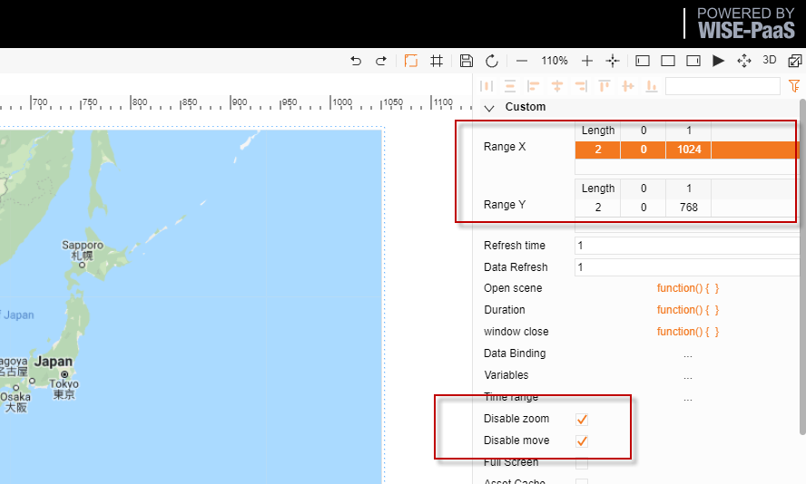
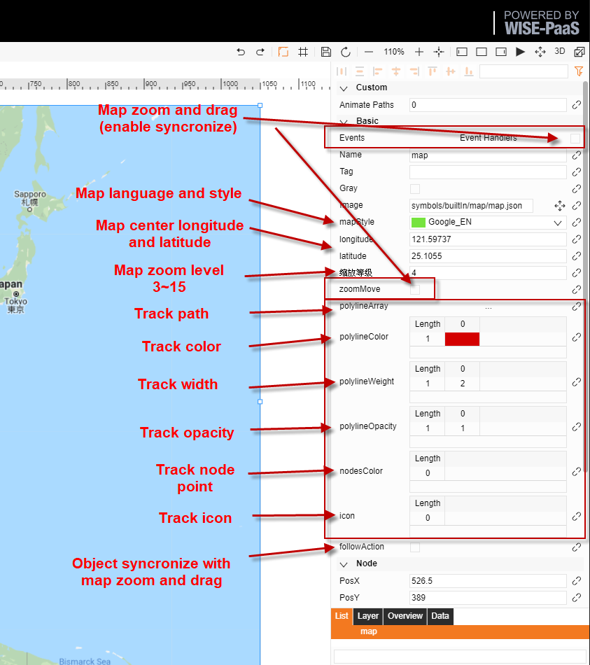
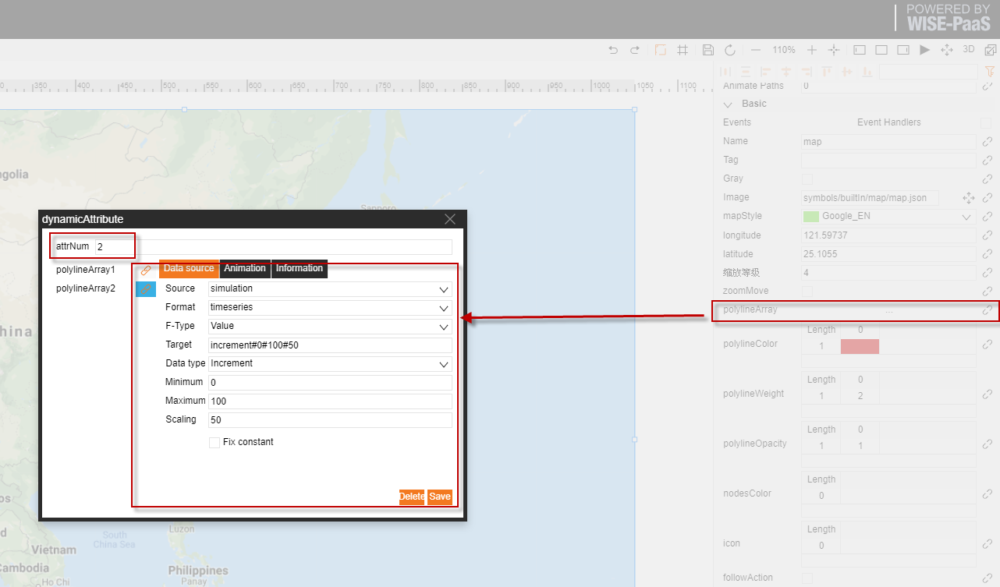

# SaaS Composer Map Function User Guide
2020-08-03

### Select the icon “symbols/builtIn/map/map.json” to perform the map function 

####

1. Create a drawing sheet. Locate the icon of map under the map menu in the builtIn folder and drag the icon onto the drawing sheet. 

2. Deselect “**zoomMove**” at the right-hand side to adjust the map size and position

3. Click on the blank page of the drawing sheet, adjust the range of the map at the right-hand side to enable complete display of the map on the screen, and select the “**Disable zoom**” and “**Disable move**” options.

4. Map attribute settings

5. User guide for the trajectory function
	1. Click the binding button to open the binding page and then enter the number of trajectories that require binding in order to bind the data to the corresponding trajectory 
	2. Select “**Array**” as the format type
	3. Adjust the array length for the trajectory attributes according to the number of trajectories and then set the numerical values of each trajectory. Value of each points data format is "longitude, latitude". 
	4. Set the trajectory color. Note that if the field of trajectory color remains blank, the color is set to be “#008BD5” by default.
	5. Set the trajectory width. This is the numerical value representing the width of the trajectory path. Note that if the field remains blank, this is set to 1 by default. 
	6. Set the trajectory node value to set the color of the node. Note that if the field remains blank, this attribute will not be displayed by default.  
	7. Optionally, set the additional label value, which is the value of label displayed additionally. If the field remains blank, it is not set by default.

6. Special functions
&emsp;6-1. Connection and synchronization (the attribute of followAction) 
&emsp;&emsp;SaaS Composer supports the connection of elements to the map. 	
&emsp;&emsp;Create a new object to be connected to the map. 
&emsp;&emsp;The connection attribute can control whether the object moves synchronously with the map as it is dragged or as the user zooms in and out. 

&emsp;6-2. Additional label for trajectory 
&emsp;&emsp;Create an object and set its label, and enter the label value into the icon field. 
&emsp;&emsp;The object will appear at the latest position on the trajectory in preview mode.

