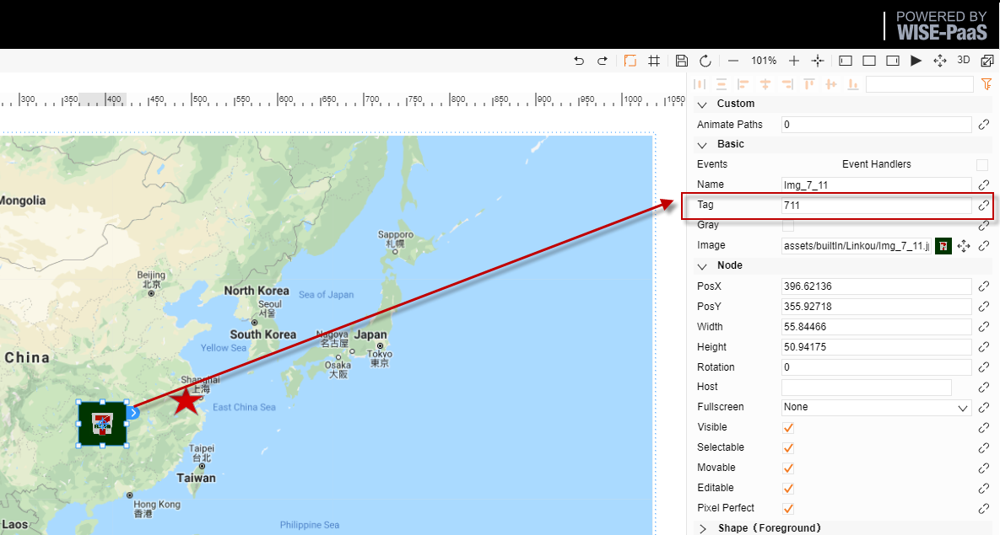

# 地圖功能使用手冊  

使用 symbols/builtIn/map/map.json 這個圖示來實現地圖功能  

1. 創建圖紙，在圖示的 builtIn 資料夾 map 目錄下找到地圖圖示並拖入圖紙中
2. 勾選掉右側 zoomMove 屬性，調整地圖大小以及位置  

3. 點擊圖紙空白頁，在右側調整顯示範圍使地圖可以完整的顯示在螢幕中，並且勾選取消移動和取消縮放選項  

4. 設置地圖屬性  

5. 軌跡功能使用說明  

	1. 點擊綁定按鈕，打開綁定頁面，輸入需要綁定的軌跡數量，分別綁定對應的資料
    2. 根據輸入的軌跡數量修改其餘軌跡功能屬性的陣列長度，並分別設置數值
    3. 軌跡顏色不填則默認 "#008BD5" 顏色
    4. 軌跡寬度為軌跡路徑的寬度數值，若不填，默認為 1
    5. 軌跡節點值為節點處顏色屬性，若不填，預設不顯示
    6. 額外標注為額外顯示標注的標籤值，若不填，默認不設置

6. 特殊功能說明  

	1. 吸附與同步功能（followAction屬性）  
		SaaS Composer 支援將部分元素吸附在地圖上     
		連接屬性選擇吸附，創建一個新的圖元吸附在地圖上，該屬性可以控制該圖元是否隨著地圖的拖拽和縮放進行同步移動  

  

	2.  軌跡功能的額外標注屬性  
    	創建一個圖元，設置他的標籤屬性，並將標籤值填入 icon 屬性中
    	在預覽時候該元素會出現在軌跡的最新位置

