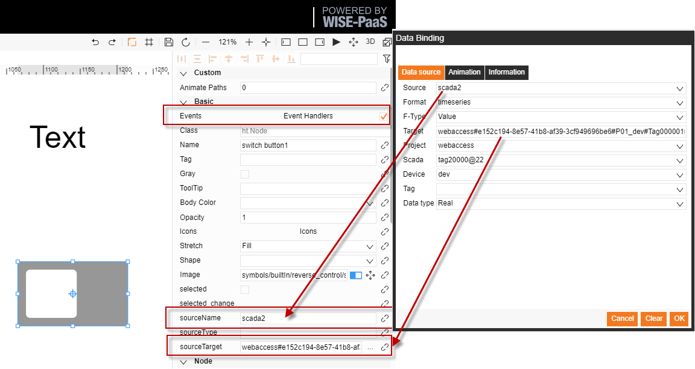
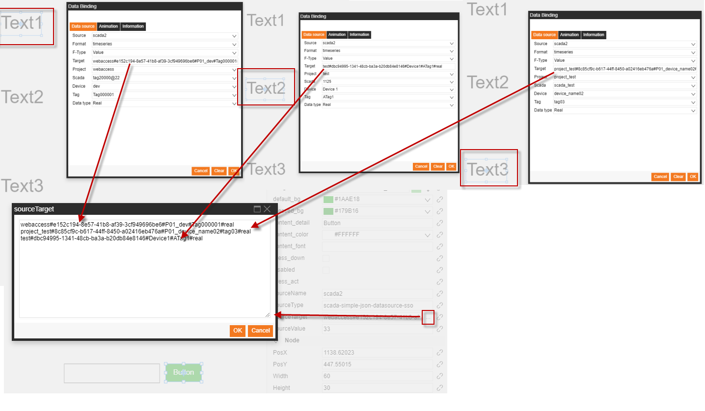

# Reverse control

The SaaS Composer supports the reverse control of SCADA and RMM data sources via two methods:
1. Calling the interface method of reverse control directly in event processing    
2. Use the reverse control mask icon (requires the event processing option of the reverse control icon to be checked)    

	Note: The reverse control function of SCADA needs to bind the SCADA data source by connecting to the “**portal-scada**” application. 
        

**I. Calling the interface method of reverse control directly in event processing**

Description of the reverse control method and its parameters				

	dataRefreshUtil.setValue(datasourceName,datasourceType,{ 
    	    "target" : target,     	   
		    "value" : "123"
 	})		
		    // datasourceName : Name of data source
		    // datasourceType : Plugin type corresponding to the plugin name   For example: “scada-simple-json-datasource-sso”
		    // target : Target data to be controlled
  

**II.	Use mask icon**

Mask switch icon usage:

1. Icon location:       
The switch button1 icon in the reverse_control folder in the builtIn directory    
Path: “symbols/builtIn/reverse_control/switch button1.json” 
2. Required parameters and filling steps
As shown in the picture on the left 
3. Function         
Switch control; set value as 0 or 1          

Mask set value icon usage method:    
This function can be combined with an input box 
1. Icon location        The button icon; the Set value button icon in the reverse_control folder in the builtIn directory        Path: “symbols/builtIn/reverse_control/Set value button.json”        The input icon; the input icon in the “ui” folder in the builtIn directory        Path: “symbols/builtIn/ui/input.json” 
2. Required parameters and how to fill them in       As shown in the picture on the left. 
3. Function       Set value       
3.1 Use the snap function to snap the button onto the input box to dynamically set the value in the input box     
3.2 If not snapped and there is no input box, the value of source Value will be set     
  

**2.3 Group control**

Group control function Usage method:    
This function can control the reverse control of multiple equipment with one button
1.	Requirement    
The source of multiple data bindings to be the same
2.	Required parameters and how to fill them in    
As shown in the picture on the left  
3.	Function     
Same as the set value mask icon               