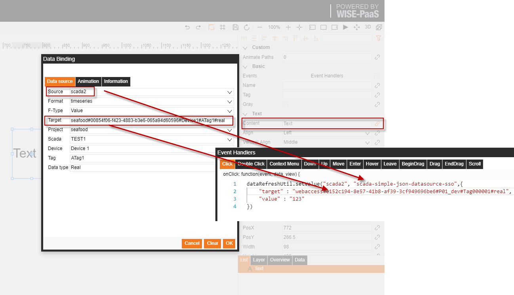
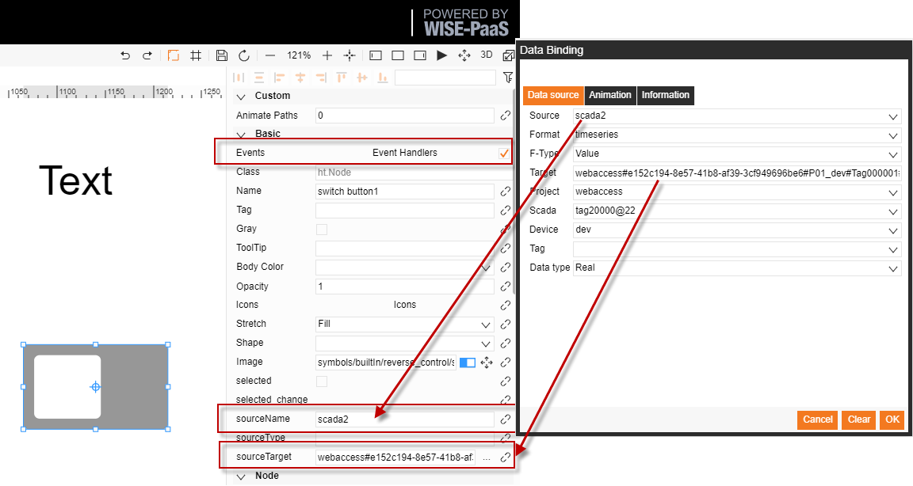
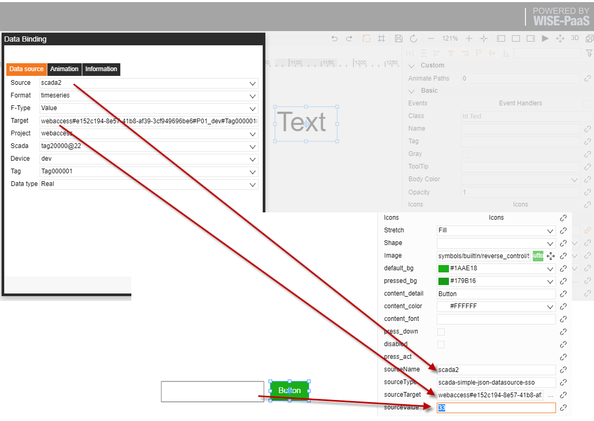
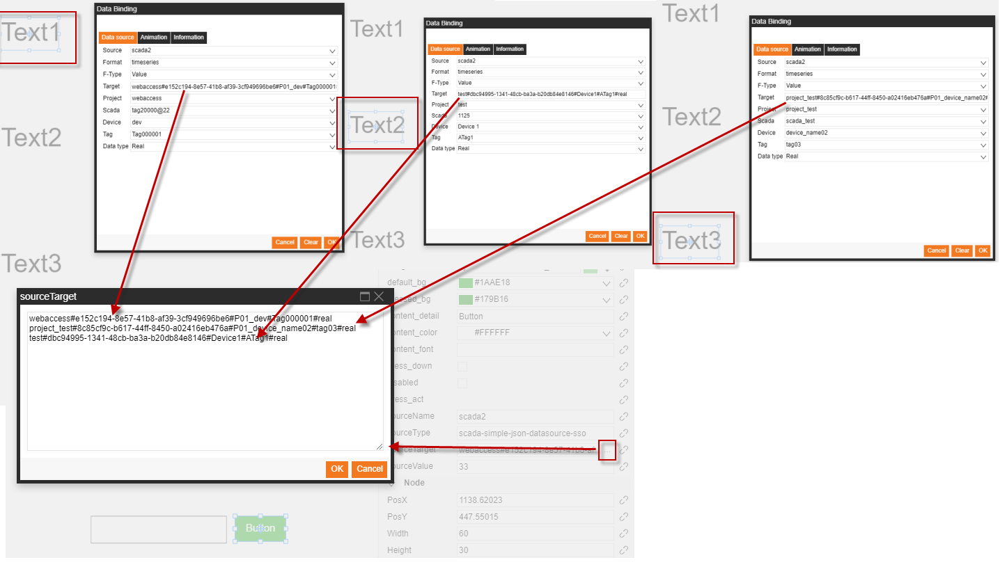

# 反向控制  

SaaS Composer 支援對 scada 以及 RMM 的反向控制功能實現方式有兩種：  

1. 直接在事件處理中調用反向控制的介面方法  
2. 使用反向控制的封裝圖示 (需要勾選反向控制圖示的事件處理選項）  

注：scada 的反向控制功能需要使用連接 portal-scada APP 的方式來綁定 scada 資料來源           

# I. 直接在事件處理中調用反向控制的介面方法

反向控制方法及其參數說明  				

	dataRefreshUtil.setValue(datasourceName,datasourceType,{ 
    	    "target" : target,     	   
		    "value" : "123"
 	})		
		    // datasourceName : Name of data source
		    // datasourceType : Plugin type corresponding to the plugin name   For example: “scada-simple-json-datasource-sso”
		    // target : Target data to be controlled
  

## II.	使用封裝圖示

Mask switch icon usage:

封裝開關圖示使用方式：  

1. 圖示所在位置  
        圖示 builtIn 目錄下，reverse_control 資料夾中的 switch button1 圖示
        路徑：symbols/builtIn/reverse_control/switch button1.json
2. 需要參數及填寫方式  
        如上圖
3. 功能  
        開關控制，即設置 0、1 值        
    

封裝設置值圖示使用方式：  

該功能可以和 input 框進行結合  
1. 圖示所在位置    
        button 圖示 builtIn 目錄下，reverse_control 資料夾中的 Set value button 圖示  
        路徑：symbols/builtIn/reverse_control/Set value button.json  
        input 框圖標 builtIn 目錄下，ui 資料夾中的 input 圖示  
        路徑：symbols/builtIn/ui/input.json  
2. 需要參數及填寫方式  
        如上圖  
3. 功能  
       設置值  
       3.1 使用吸附功能將 button 吸附到 input 框上，即可實現動態設置 input 框內數值  
       3.2 若不吸附，無 input 框，則設置 sourceValue 的值       
  

## III 群控

群控功能使用方式：  
該功能可以使用一個按鈕來控制多個設備的反向控制  

1. 要求多個資料綁定的來源相同，  
2. 需要參數及填寫方式  
       如上圖  
3. 功能  
       與設置值封裝圖示相同               