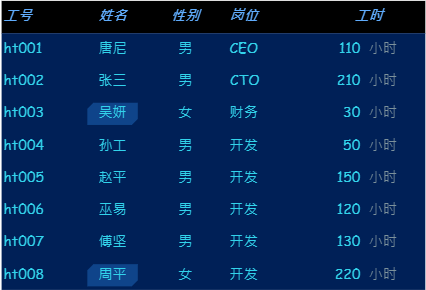
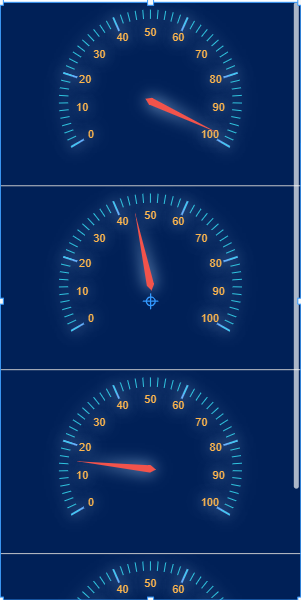

# 表格    

## table columns 配置  

 

| Field         | Type                           |  Default  | Description  |
|--------------|-------------------------------|---------|---|
| key          | string                        |         | The key of the column  |
| displayName  | string                        |         | The display name of the column. If empty, the key will be displayed  |
| width        | number                        | 0.1     | The width of the column. If >= 1, it's a fixed value. If < 1, it's a percentage relative to the table  |
| align        | string                        | left    | The horizontal alignment of the column. Values: left / center / right  |
| vAlign       | string                        | middle  | The vertical alignment of the column. Values: top / middle / bottom  |
| headColor    | string / function(column)     |         | The text color of the column header. Default uses the table header color setting  |
| bodyColor    | string / function(cell, row)  |         | The text color of the column content. Default uses the table content color setting  |
| color        | string / function(cell, row)  |         | The text color of both header and content. It can be overridden by headColor and bodyColor. Default uses the table color setting  |
| headFont     | string / function(column)     |         | The font of the column header text. Default uses the table header font setting  |
| bodyFont     | string / function(cell, row)  |         | The font of the column content text. Default uses the table content font setting  |
| font         | string / function(cell, row)  |         | The font of both header and content text. It can be overridden by headFont and bodyFont. Default uses the table font setting  |
| format       | function           |         | Formatting function. Params: function(val, row) where val is the current cell text and row is the current row data  |
| isIcon       | boolean            | false   | Whether to treat column data as an image URL for image rendering  |
| drawHeadCell     | function           |         | Cell drawing function. Params: function(g, text, rect, option) where - g: Graphics object - text: Cell content - rect: Cell rectangle range - option: {  font: // Font  color: // Text color  column: // Current column definition object  colIndex: // Column index  row: // Current row data  rowIndex: // Row index  defaultDraw: // Default cell drawing, can be called directly with defaultDraw(), no need to pass params  data:// Current node object }  |
| drawCell     | function           |         | Cell drawing function. Params: function(g, text, rect, option) where - g: Graphics object - text: Cell content - rect: Cell rectangle range - option: {  font: // Font  color: // Text color  column: // Current column definition object  colIndex: // Column index  row: // Current row data  rowIndex: // Row index  defaultDraw: // Default cell drawing, can be called directly with defaultDraw(), no need to pass params  data:// Current node object }  |

## row color  

  

`ht.drawRow`

    if (rawIndex % 2 === 1) {
        g.fillStyle = 'rgba(0, 92, 231, 0.3)'
        g.fillRect(rect.x, rect.y, rect.width, rect.height);
    }

# Column display by value status  

  

`ht.columns`

    [
        {
            "key": "empNo",
            "displayName": "工号",
            "width": "80"
        },
        {
            "key": "name",
            "displayName": "姓名",
            "width": "60",
            "align": "center",
            "drawCell": function(g, text, rect, option) {
                var defaultDraw = option.defaultDraw,
                    row = option.row,
                    x = rect.x + 5,
                    y = rect.y + 5,
                    width = rect.width - 10,
                    height = rect.height - 10,
                    off = 6;
                if (row.sex === '女') {
                    g.beginPath();
                    g.moveTo(x + off, y);
                    g.lineTo(x + width, y);
                    g.lineTo(x + width, y + height - off);
                    g.lineTo(x + width - off, y + height);
                    g.lineTo(x, y + height);
                    g.lineTo(x, y + off);
                    g.closePath();
                    g.fillStyle = 'rgba(51,153,255,0.3)';
                    g.fill();
                }
                
                defaultDraw();
            }
        },
        {
            "key": "sex",
            "align": "center",
            "displayName": "性别"
        },
        {
            "key": "job",
            "displayName": "岗位"
        },
        {
            "key": "workTime",
            "displayName": "工时",
            "align": "center",
            "width": 112,
            "drawCell": function(g, text, rect, option) {
                var font = option.font,
                    color = option.color,
                    x = rect.x,
                    y = rect.y,
                    width = rect.width,
                    height = rect.height,
                    radius = (height - 6) / 2,
                    defaultDraw = option.defaultDraw,
                    ts = ht.Default.getTextSize(font, text),
                    ts2 = ht.Default.getTextSize(font, '小时保养'),
                    tw = ts.width + ts2.width - 6,
                    padding = (width - tw) / 2;
                
                ht.Default.drawText(g, text, font, color, x , y, 50, height, 'right', 'middle');
                ht.Default.drawText(g, '小时', font, 'rgb(124,145,155)', x + 50+4, y, ts2.width, height, 'left', 'middle');

            }
        }
    ]

# Column use image or symbol    

  

`ht.columns`

    [
        {
            "key": "value",
            "drawCell": function(g, text, rect, option) {
                var row = option.row;
                var value = row.value;
                var data = new ht.Data();
                data.a('ht.value', value);
                ht.Default.drawStretchImage(g, ht.Default.getImage('symbols/ht/gauge/gauge.json'), 'uniform', rect.x, rect.y + 8, rect.width, rect.height, data)
            }
        }
    ]

# table column visible  

`ht.columnVisibleFunc`  

 return `true` / `false`

    function(col, colIndex, data, view) {
        return value.indexOf(col.key) >= 0;  
    }
