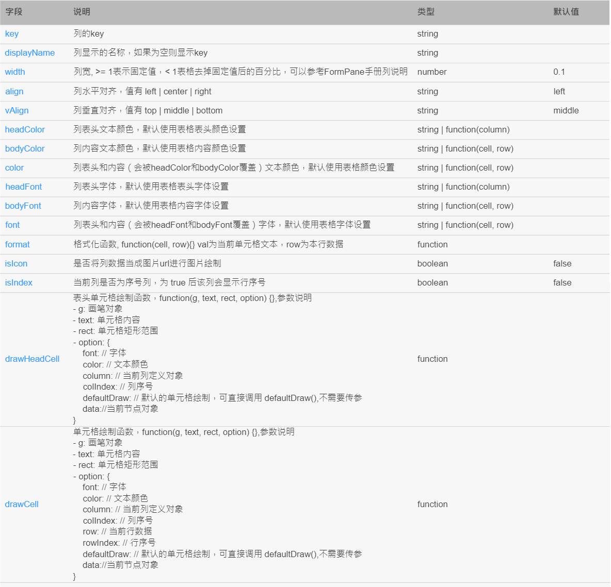
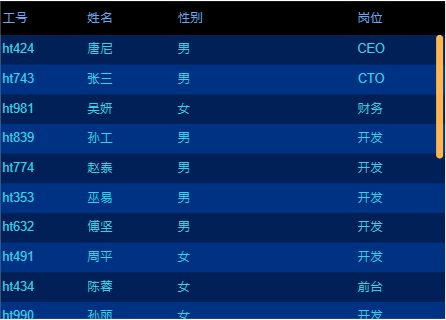
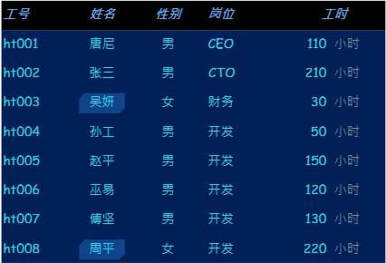
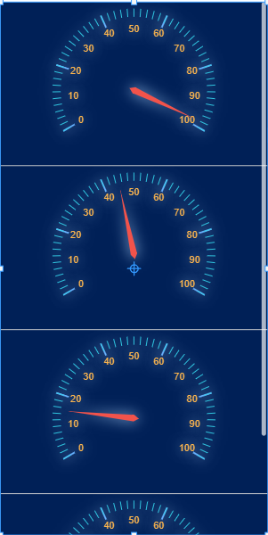

# Table  

## table columns 配置  

 

| 字段         | 類型                           |  默認值  | 說明  |
|--------------|-------------------------------|---------|---|
| key          | string                        |         | 列的key  |
| displayName  | string                        |         | 列顯示的名稱，如果為空則顯示key  |
| width        | number                        | 0.1     | 列寬,>= 1表示固定值,< 1表格去掉固定值後的百分比  |
| align        | string                        | left    | 列水平對齊，值有left / center / right  |
| vAlign       | string                        | middle  | 列垂直對齊，值有top / middle / bottom  |
| headColor    | string / function(column)     |         | 列表頭文本顏色，默認使用表格表頭顏色設置  |
| bodyColor    | string / function(cell, row)  |         | 列內容文本顏色，默認使用表格內容顏色設置  |
| color        | string / function(cell, row)  |         | 列表頭和內容（會被headColor和bodyColor覆蓋）文本顏色，默認使用表格顏色設置  |
| headFont     | string / function(column)     |         | 列表頭文本字體，默認使用表格表頭字體設置  |
| bodyFont     | string / function(cell, row)  |         | 列內容文本字體，默認使用表格內容字體設置  |
| font         | string / function(cell, row)  |         | 列表頭和內容（會被headFont和bodyFont覆蓋）文本字體，默認使用表格字體設置  |
| format       | function           |         | 格式化函數, function(val, row){} val為當前單元格文本，row為本行數據  |
| isIcon       | boolean            | false   | 是否將列數據當成圖片url進行圖片繪制  |
| drawHeadCell     | function           |         | 單元格繪制函數，function(g, text, rect, option) {},參數說明 - g: 畫筆對象 - text: 單元格內容 - rect: 單元格矩形範圍 - option: {     font: // 字體     color: // 文本顏色     column: // 當前列定義對象     colIndex: // 列序號     row: // 當前行數據     rowIndex: // 行序號     defaultDraw: // 默認的單元格繪制，可直接調用 defaultDraw(),不需要傳參     data://當前節點對象 }  |
| drawCell     | function           |         | 單元格繪制函數，function(g, text, rect, option) {},參數說明 - g: 畫筆對象 - text: 單元格內容 - rect: 單元格矩形範圍 - option: {     font: // 字體     color: // 文本顏色     column: // 當前列定義對象     colIndex: // 列序號     row: // 當前行數據     rowIndex: // 行序號     defaultDraw: // 默認的單元格繪制，可直接調用 defaultDraw(),不需要傳參     data://當前節點對象 }  |

## 單雙 row 顏色交錯  

 

  

`ht.drawRow`

    if (rawIndex % 2 === 1) {
        g.fillStyle = 'rgba(0, 92, 231, 0.3)'
        g.fillRect(rect.x, rect.y, rect.width, rect.height);
    }

# Column 隨值狀態做不同顯示  

  

`ht.columns`

    [
        {
            "key": "empNo",
            "displayName": "工号",
            "width": "80"
        },
        {
            "key": "name",
            "displayName": "姓名",
            "width": "60",
            "align": "center",
            "drawCell": function(g, text, rect, option) {
                var defaultDraw = option.defaultDraw,
                    row = option.row,
                    x = rect.x + 5,
                    y = rect.y + 5,
                    width = rect.width - 10,
                    height = rect.height - 10,
                    off = 6;
                if (row.sex === '女') {
                    g.beginPath();
                    g.moveTo(x + off, y);
                    g.lineTo(x + width, y);
                    g.lineTo(x + width, y + height - off);
                    g.lineTo(x + width - off, y + height);
                    g.lineTo(x, y + height);
                    g.lineTo(x, y + off);
                    g.closePath();
                    g.fillStyle = 'rgba(51,153,255,0.3)';
                    g.fill();
                }
                
                defaultDraw();
            }
        },
        {
            "key": "sex",
            "align": "center",
            "displayName": "性别"
        },
        {
            "key": "job",
            "displayName": "岗位"
        },
        {
            "key": "workTime",
            "displayName": "工时",
            "align": "center",
            "width": 112,
            "drawCell": function(g, text, rect, option) {
                var font = option.font,
                    color = option.color,
                    x = rect.x,
                    y = rect.y,
                    width = rect.width,
                    height = rect.height,
                    radius = (height - 6) / 2,
                    defaultDraw = option.defaultDraw,
                    ts = ht.Default.getTextSize(font, text),
                    ts2 = ht.Default.getTextSize(font, '小时保养'),
                    tw = ts.width + ts2.width - 6,
                    padding = (width - tw) / 2;
                
                ht.Default.drawText(g, text, font, color, x , y, 50, height, 'right', 'middle');
                ht.Default.drawText(g, '小时', font, 'rgb(124,145,155)', x + 50+4, y, ts2.width, height, 'left', 'middle');

            }
        }
    ]

# Column 放入圖片(圖標)顯示  

  

`ht.columns`

    [
        {
            "key": "value",
            "drawCell": function(g, text, rect, option) {
                var row = option.row;
                var value = row.value;
                var data = new ht.Data();
                data.a('ht.value', value);
                ht.Default.drawStretchImage(g, ht.Default.getImage('symbols/ht/gauge/gauge.json'), 'uniform', rect.x, rect.y + 8, rect.width, rect.height, data)
            }
        }
    ]

# 透過其他控制項調整 table 顯示 column  

`ht.columnVisibleFunc`  

返回 return `true` / `false`

    function(col, colIndex, data, view) {
        return value.indexOf(col.key) >= 0;  
    }
